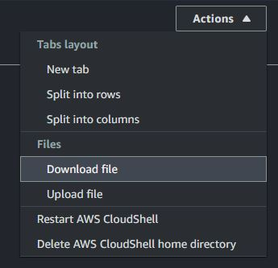
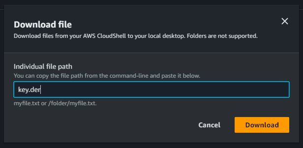
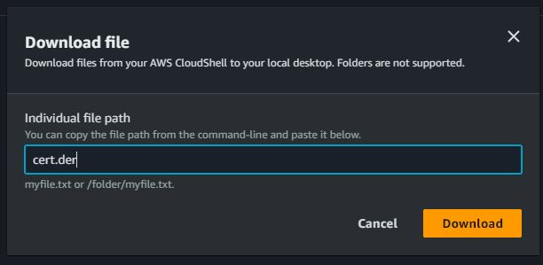
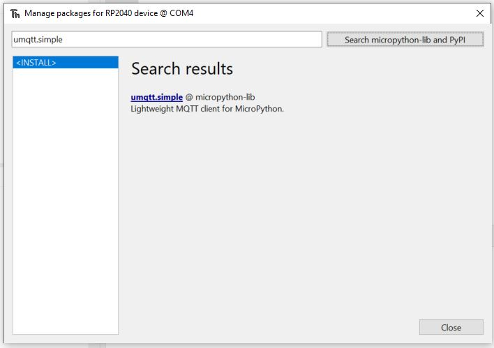
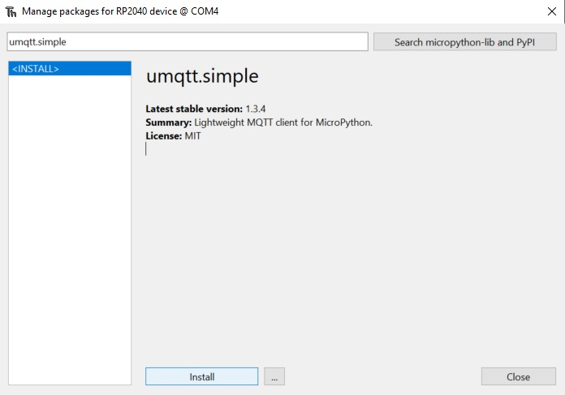
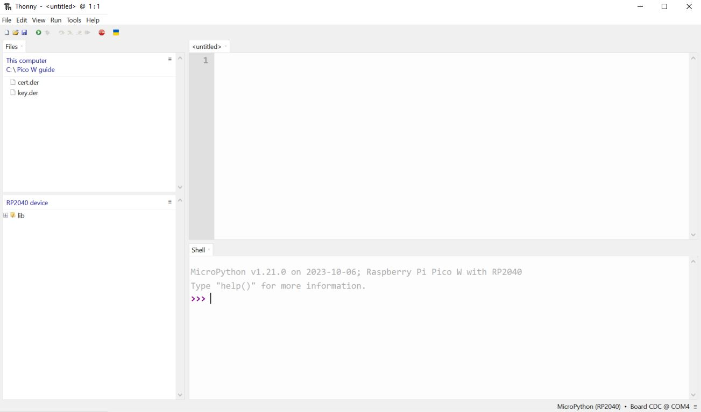
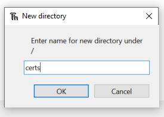
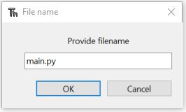
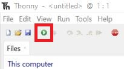
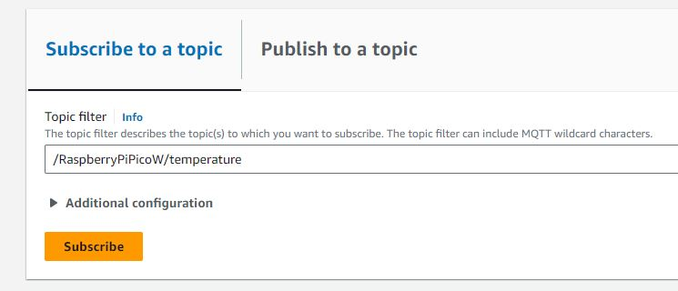

Let’s assume that you have an amazing idea for a new Internet of Things (IoT) project. What hardware makes sense for your use case? And how do you easily connect it to the AWS cloud?

There is a lot of variety in IoT hardware, but given device constraints, there can also be many challenges – such as limited connectivity options, or integration complexity with other components. Security and software support can also vary. For many, a general purpose, all-in-one solution is ideal to accelerate development.

One popular hardware choice is the Raspberry Pi Pico W (“Pico W”) microcontroller board for its low cost, versatility, and built-in wireless capabilities. It is a compact, dual core microcontroller board that has built-in 2.4GHz 802.11n wireless LAN and Bluetooth 5.2 connectivity, making it easy to get your device connected to a network. You can learn about the Raspberry Pi Pico series of boards [here](https://www.raspberrypi.com/products/raspberry-pi-pico/).

The next step will be to connect it to AWS to take advantage of the choice and flexibility of over 200 fully-featured services – ranging from IoT data ingest, data storage, analytics, and more – allowing you to build a robust IoT solution. The starting point will be [AWS IoT Core](https://aws.amazon.com/iot-core/), which helps you securely connect and manage IoT devices at scale. Through IoT Core, your devices can exchange messages using MQTT, HTTP, or WebSockets protocols, and interact with downstream services.

In this guide, we will walk you through quickly connecting your Raspberry Pi Pico W device to AWS IoT Core, so you can start building your cloud-connected IoT project.

Here are the main steps:

- Create a *Thing* in AWS IoT Core, and set up the certificates and IoT Policy
- Configure your Pico W device to connect to AWS IoT Core
- Test and validate by sending data from the Pico W to AWS
- Send data back from AWS to the Pico W

The best way to learn about AWS IoT is to get hands-on experience. So let’s jump into setting up your first device and getting it connected!

## Requirements

Before we get started, make sure you have the following ready:

- AWS account with console access
- Raspberry Pi Pico W hardware device
- Development computer with [Thonny](https://thonny.org/) installed
- Micro USB cable to connect your Pico W device to your development computer
- WiFi network name and credentials to connect your Pico W device to the internet

## Creating a *Thing* in AWS IoT Core

In this section, we will use [AWS CloudShell](https://aws.amazon.com/cloudshell/) to issue AWS Command Line Interface (CLI) commands for creating an AWS IoT *Thing*. In AWS IoT, a *Thing* is a virtual representation of a hardware device in the cloud - in this case, your Pico W device. Then, we will generate the digital certificates and keys needed for mutual authentication between your Pico W device and AWS IoT Core. Finally, we will create an IoT Policy that will define the access permissions for your device in AWS, and attach the policy so it takes effect.

AWS CloudShell is a browser-based command prompt that you can access from within the AWS Console. It allows you to quickly run AWS CLI commands, without having to install and configure the AWS CLI on your development computer.

1. Log into your AWS account via the [AWS Console](https://console.aws.amazon.com/console/home).
2. Select the region you would like to create the IoT resources in.
3. Open AWS CloudShell by clicking the “>_” icon along the top of the console.

   

4. Install OpenSSL into the CloudShell session. [OpenSSL](https://www.openssl.org/) is an open-source tool for working with digital keys and certificates. It is a pre-requisite for further steps. Enter the following command in the CloudShell prompt:

   ```bash
   sudo yum install -y openssl
   ```

5. Define a name for the *Thing* in AWS:

   ```bash
   THING_NAME=RaspberryPiPicoW
   ```

   - Each *Thing* needs a unique name. In this example, we are using `RaspberryPiPicoW` for illustration purposes, but you can select any name.

   - The name will be stored in an environment variable for later steps.

6. Create the *Thing* in AWS IoT, assigning the *Thing* name from earlier:

   ```bash
   aws iot create-thing --thing-name $THING_NAME
   ```

7. Generate the keys and certificates needed for authenticating the *Thing*:

   ```bash
   aws iot create-keys-and-certificate --set-as-active \
   --public-key-outfile ${THING_NAME}-public.key \
   --private-key-outfile ${THING_NAME}-private.key \
   --certificate-pem-outfile ${THING_NAME}-certificate.pem > ${THING_NAME}_response
   # Parse output for certificate ARN and ID
   CERTIFICATE_ARN=$(jq -r ".certificateArn" ${THING_NAME}_response)
   CERTIFICATE_ID=$(jq -r ".certificateId" ${THING_NAME}_response)
   ```

   - Digital certificates are used for mutually authenticating between devices and AWS IoT Core. At a later step, device certificates will need to be uploaded to your Pico W device, so they can be presented by the device.

   - As a best practice, every IoT *Thing* should have its own unique certificate.

   - This command will produce a key and a certificate file. Then, the certificate’s ARN and ID values will be captured and stored in environment variables for later use.

8. Create the IoT Policy for the *Thing*:

   ```bash
   POLICY_NAME=${THING_NAME}_Policy
   aws iot create-policy --policy-name $POLICY_NAME --policy-document '{
       "Version": "2012-10-17",
       "Statement": [
           {
               "Effect": "Allow",
               "Action": "iot:*",
               "Resource": "*"
           }
       ]
   }'
   ```

   - The command will use the *Thing’s* name as part of the policy name to ensure uniqueness.

   - Once attached to a *Thing* in AWS IoT, this IoT Policy will control what that *Thing* can access.

   - **Caution:** This IoT policy is overly permissive but is easiest for illustration purposes. Practicing least privilege is a security best practice - hence permissions should be locked-down to permit devices to only access what they need, and nothing more. For more details and best practices on writing IoT policies, please refer to [Best Practice 1.2 – Assign least privilege access to devices](https://docs.aws.amazon.com/wellarchitected/latest/iot-lens-checklist/best-practice-1-2.html).

9. Attach the IoT Policy to the certificate:

   ```bash
   aws iot attach-policy --policy-name $POLICY_NAME --target $CERTIFICATE_ARN
   ```

   - In AWS IoT, IoT Policies are attached to certificates. The policy will then apply to a *Thing* when you attach the certificate to that *Thing*.

10. Attach the certificate to the *Thing*:

    ```bash
    aws iot attach-thing-principal --thing-name $THING_NAME --principal $CERTIFICATE_ARN
    ```

11. Convert the certificates to DER format:

    ```bash
    openssl rsa -in ${THING_NAME}-private.key -out key.der -outform DER
    openssl x509 -in ${THING_NAME}-certificate.pem -out cert.der -outform DER
    ```

    - The MicroPython firmware running on your Pico W requires keys and certificates to be in DER format. Therefore, this additional step is required to convert the private key and certificate file into that format before uploading them to the device.

12. Download the certificate and key files from CloudShell:

    1. You will need 2 files, and they will need to be downloaded one at a time.

    2. In the CloudShell window, click **Actions**.

       

    3. Select **Download file**.

    4. You will be prompted to provide the path/name of each file. As the files have been saved to ~ (current user's home directory), you can just enter the filename. Download the key file `key.der`.

       

    5. Click the **Download** button.

    6. Do this step again for certificate file `cert.der`.

       

    7. Note where your browser saves those files to your local computer. You will need them shortly.

13. Get and save the IoT Endpoint url for later:

    ```bash
    IOT_ENDPOINT=$(aws iot describe-endpoint --endpoint-type iot:Data-ATS --output text)
    echo "AWS IoT EndPoint: $IOT_ENDPOINT"
    ```

    - The AWS IoT Endpoint will be unique to your AWS account. Your fleet of devices will connect to it.

## Configure the Raspberry Pi Pico W Device

Now that we have setup your device on the cloud side, we now need to configure the hardware device locally.

You will connect your Pico W device to your development computer via the micro USB cable, and access it via Thonny. [Thonny](https://thonny.org/) is an open-source Python IDE ideal for learning. For this tutorial, we assume that you have already installed Thonny on your computer. At the time of writing, we were using Thonny v.4.1.2.

1. Launch Thonny on your computer.

2. Connect your Pico W device to your computer using the micro USB cable.

3. Thonny detects your device.

   - If this is your first-ever use of your Pico W device, you will need to install the MicroPython firmware on it before continuing. To do so, please follow the official instructions [here](https://projects.raspberrypi.org/en/projects/get-started-pico-w/1) (stopping at the point where you copy the firmware files and then open the Thonny editor). Once the firmware is installed, disconnect and reconnect your device. Then, continue to the next step.

   - Depending on how many devices Thonny detects on your computer, you may need to specifically select your Pico W device from the list in the bottom right corner of the Thonny window. It is very likely that you are looking for an option that will be labelled (or contain) "MicroPython (RP2040)" or "MicroPython (Raspberry Pi Pico)", followed by a serial port ID. Either selection should work.

     

4. Install the MQTT client on your Pico W:

   1. In Thonny, under the **Tools** menu, select **Manage Packages**.
   2. In the search box, enter `umqtt.simple`, and click **Search**.

      

   3. Select `umqtt.simple` from the search results and install the latest stable version of the package.

      

   4. Click **Close**.

5. Upload certificate and key files to your Pico W device:

   - In Thonny, ensure the **Files** pane is visible. If not, select **View** menu, then **Files**.
   - The top half of that pane represents your computer.
   - The bottom half of that pane represents your Pico W device (in our example showing as **RP2040 Device**).

     

   1. In the **RP2040 device** portion (bottom) of the **Files** pane, create a folder in the root called `certs`:

      1. Click the menu icon (**≡**) and select **New Directory**.
      2. Enter the name `certs`.

         

      3. Click **OK**.
      4. Double click on the `certs` folder to go into it.

   2. From the **This computer** (top) portion of the **Files** pane, browse to the location of the downloaded certificate files on your local computer:

      1. Select each `.DER` file individually.
      2. Right-click each `.DER` file and select **Upload to /certs**.

   3. From the **RP2040 device** portion (bottom) of the **Files** pane, you should now see the two `.DER` files in the certs folder on the device.

      

6. Create the `main.py` script on the Pico W device to connect to AWS IoT Core:

   - You will create a file called `main.py` in the root of your Pico W device. Your device will execute this script every time it powers-up.

   - Below ([Appendix 1](#appendix-1-mainpy)), we have provided sample code that you can paste into it. Before you can connect your device to AWS IoT Core, you must update this script with some additional configuration information, such as local wifi credentials, device name, and your AWS IoT Core Endpoint.

   1. With your Pico W device still connected to your development computer, open Thonny.

   2. Navigate to the root of the device (bottom half of **Files** pane).

   3. Click the menu icon (**≡**), and select **New File**.

      

   4. Enter the filename: `main.py`.

      

   5. Copy and paste the sample code (from [Appendix 1](#appendix-1-mainpy)) into the `main.py` file.

      - We will be making minor adjustments to the sample code. All required edits are grouped together and occur in between the comment lines `Start code modification` and `End code modification`. The area is clearly marked by a full line of `#` characters.

   6. Replace the Wifi credentials:

      1. `SSID = b‘<your wifi network name>’`
      2. `PASS = b‘<your wifi password>’`
         &nbsp;

      - If you have any special characters in your SSID or password, you may need to escape them with a `\` character.

   7. Replace the *Thing* name:
      1. The sample code uses  `CLIENT_ID = b’RaspberryPiPicoW’`, but if you defined a different *Thing* name earlier, substitute that name for `RaspberryPiPicoW`.

   8. Replace the AWS IoT Endpoint:
   
      1. Refer to the output of Step 13 in [Creating a Thing in AWS IoT Core](#creating-a-thing-in-aws-iot-core) to get your AWS IoT Endpoint.

      2. Paste the AWS IoT Endpoint into `AWS_ENDPOINT = b’<your IoT Endpoint value here>‘`.

   9. Save the `main.py` file to update changes.

   - **Tip**: The code is heavily commented. Feel free to browse through the remainder of the `main.py` script to see what the various sections do.

7. Click the **Run current script** button in Thonny to execute the script for testing. Otherwise, the device will execute `main.py` at power-up.

   

## Validate Message Flow Between the Pico W and AWS IoT Core

Now that we have configured the Pico W device and its corresponding *Thing* in AWS IoT Core, we are ready to test.

From within Thonny:

1. When you run the `main.py` script in Thonny, if the device is successfully connecting and your configuration is valid, you will start to see messages appearing in the **Shell** pane every 5 seconds. You will see messages starting with `Publishing topic...`.

We can then validate that MQTT messages are flowing to AWS IoT Core by following these steps:

1. Login to the AWS Console.

2. Search for, and select **IoT Core**.

3. Click on [MQTT test client](https://console.aws.amazon.com/iot/home?#/test) on the left panel.

4. In the right pane, click **Subscribe to a topic**:

   1. In the **Topic filter** text box, enter the topic defined as `PUB_TOPIC` in the `main.py` file. In our example: `/RaspberryPiPicoW/temperature`.

      

5. Click the **Subscribe** button.

6. You should see a new message appearing in the test client every five seconds. This confirms that the device is successfully sending messages to AWS IoT Core.

The device’s `main.py` script also subscribes to a topic (defined as `SUB_TOPIC`). In our example, `/RaspberryPiPicoW/light`. You can test sending data back to the device by publishing a test message to this topic.

1. Staying within the AWS IoT MQTT test client, click on **Publish to topic**:

   1. Enter the **topic name** for publishing: `/RaspberryPiPicoW/light`.
   2. For the **message payload**, clear the box and paste in the following JSON payload:

      ```json
      { "state": "on" }
      ```

2. Click **Publish** to send the message to the device.

3. When the device receives the message, the on-board LED will illuminate (Green).

4. You can also turn the light off by sending another message with following JSON payload:

   ```json
   { "state": "off" }
   ```

## Bonus: View the Created Resources in AWS IoT Core

While you are in the AWS IoT Core console, you can explore the different IoT constructs that we created earlier with our CloudShell CLI commands. Regardless of whether you use the AWS console, the AWS CLI, or the AWS SDKs, the resulting resources will be the same, and can be explored and manipulated by any of these different methods.

In AWS IoT Core console:

1. You can see the IoT *Thing*:

   1. In the left column, under **Manage**, select **All Devices** > **Things**.
      - It will list all of your AWS IoT *Things*.
      - Click any of them for more details.

2. You can see the IoT Policy:

   1. In the left column, under **Manage**, select **Security** > **Policies**.
      - It will list all of your AWS IoT Policies.
      - Click any of them for more details.

3. You can see the Certificates:
   1. In the left column, under **Manage**, select **Security** > **Certificates**.
      - It will list all of your AWS IoT Certificates.
      - Click any of them for more details.

## Conclusion

In this guide we showed you how to quickly setup and on-board your Raspberry Pi Pico W device with AWS IoT Core.

We used the browser-based AWS CloudShell command-line interface to create a virtual representation of the device as a *Thing* in AWS IoT Core. We also created the certificates and set its permissions via the IoT Policy. We then used the Thonny IDE to configure the device locally by installing the required MicroPython libraries and certificates, and then modified the `main.py` script. Finally, we validated the device’s connectivity with AWS IoT Core by sending messages to AWS IoT and observing them in the MQTT test client. We also sent messages back to the device to manipulate the device’s on-board LED.

Now that your device is connected, you are set to explore and learn more about the various other features in AWS IoT Core, including the ability to leverage other AWS services. For example, you can create rules to save your device’s data to Amazon Simple Storage Service (S3), or a variety of databases, such as Amazon Relational Database Service (RDS), Amazon DynamoDB, or Amazon TimeStream. You can also send alerts via Amazon Simple Notification Service (SNS), or trigger code using AWS Lambda when certain conditions are detected.

## Next Steps and Learn More

Learn more about AWS IoT, Raspberry Pi Pico, and MicroPython:

- [AWS IoT Core product page](https://aws.amazon.com/iot-core/)
- [AWS IoT Core Developer Guide](https://docs.aws.amazon.com/iot/latest/developerguide/what-is-aws-iot.html)
- [Raspberry Pi Pico product page](https://www.raspberrypi.com/products/raspberry-pi-pico/)
- [Raspberry Pi Pico documentation](https://www.raspberrypi.com/documentation/microcontrollers/raspberry-pi-pico.html)
- [Getting started with your Raspberry Pi Pico W](https://projects.raspberrypi.org/en/projects/get-started-pico-w/1)
- [MicroPython for RP2xxx Quick Reference](https://docs.micropython.org/en/latest/rp2/quickref.html)

## Appendix 1: main\.py

Sample MicroPython code for Raspberry Pi Pico W:

```python
# Copyright Amazon.com, Inc. or its affiliates. All Rights Reserved.
# SPDX-License-Identifier: MIT-0

# AWS IoT Core - RPi Pico W Demo

# Required imports
import time
import machine
import network
import ujson
from umqtt.simple import MQTTClient


###############################################################################
### START CODE MODIFICATION ###################################################
###############################################################################

# Wifi Name / SSID
SSID = b'<your wifi network name>'
# Wifi Password
PASS = b'<your wifi password>'

# AWS ThingName is used for the Client ID (Best Practice). Example: RaspberryPiPicoW
CLIENT_ID = b'RaspberryPiPicoW'
# AWS Endpoint (Refer to "Creating a Thing in AWS IoT Core" step 13)
AWS_ENDPOINT = b'<your IoT Endpoint value here>'

###############################################################################
### END CODE MODIFICATION #####################################################
###############################################################################


# AWS IoT Core publish topic
PUB_TOPIC = b'/' + CLIENT_ID + '/temperature'
# AWS IoT Core subscribe  topic
SUB_TOPIC = b'/' + CLIENT_ID + '/light'


# Reading Thing Private Key and Certificate into variables for later use
with open('/certs/key.der', 'rb') as f:
    DEV_KEY = f.read()
# Thing Certificate
with open('/certs/cert.der', 'rb') as f:
    DEV_CRT = f.read()


# Define light (Onboard Green LED) and set its default state to off
light = machine.Pin("LED", machine.Pin.OUT)
light.off()


# Wifi Connection Setup
def wifi_connect():
    print('Connecting to wifi...')
    wlan = network.WLAN(network.STA_IF)
    wlan.active(True)
    wlan.connect(SSID, PASS)
    while wlan.isconnected() == False:
        light.on()
        print('Waiting for connection...')
        time.sleep(0.5)
        light.off()
        time.sleep(0.5)
    print('Connection details: %s' % str(wlan.ifconfig()))


# Callback function for all subscriptions
def mqtt_subscribe_callback(topic, msg):
    print("Received topic: %s message: %s" % (topic, msg))
    if topic == SUB_TOPIC:
        mesg = ujson.loads(msg)
        if 'state' in mesg.keys():
            if mesg['state'] == 'on' or mesg['state'] == 'ON' or mesg['state'] == 'On':
                light.on()
                print('Light is ON')
            else:
                light.off()
                print('Light is OFF')


# Read current temperature from RP2040 embeded sensor
def get_rpi_temperature():
    sensor = machine.ADC(4)
    voltage = sensor.read_u16() * (3.3 / 65535)
    temperature = 27 - (voltage - 0.706) / 0.001721
    return temperature


# Connect to wifi
wifi_connect()

# Set AWS IoT Core connection details
mqtt = MQTTClient(
    client_id=CLIENT_ID,
    server=AWS_ENDPOINT,
    port=8883,
    keepalive=5000,
    ssl=True,
    ssl_params={'key':DEV_KEY, 'cert':DEV_CRT, 'server_side':False})

# Establish connection to AWS IoT Core
mqtt.connect()

# Set callback for subscriptions
mqtt.set_callback(mqtt_subscribe_callback)

# Subscribe to topic
mqtt.subscribe(SUB_TOPIC)


# Main loop - with 5 sec delay
while True:
    # Publisg the temperature
    message = b'{"temperature":%s, "temperature_unit":"Degrees Celsius"}' % get_rpi_temperature()
    print('Publishing topic %s message %s' % (PUB_TOPIC, message))
    # QoS Note: 0=Sent zero or more times, 1=Sent at least one, wait for PUBACK
    # See https://docs.aws.amazon.com/iot/latest/developerguide/mqtt.html
    mqtt.publish(topic=PUB_TOPIC, msg=message, qos=0)

    # Check subscriptions for message
    mqtt.check_msg()
    time.sleep(5)

```
