We probably would all agree that **Data Privacy** is a topic that can't be neglected in the context of data analytics and machine learning. **Generative AI** is rocking the world, but without sufficient security controls, Generative AI tools could be vulnerable to data exfiltration, resulting in unauthorized access or disclosure of sensitive information, potentially leading to privacy violations and possible misuse of both sensitive personal data or intellectual property.

[Amazon Bedrock](https://aws.amazon.com/bedrock/security-compliance/), a fully managed service, allows you to build generative AI applications that support data security and compliance standards, including **GDPR** and **HIPAA**.

With **Amazon Bedrock**, ***(not limited to)***
* Your **content** (e.g. prompt data, fine-tuning data, vector store data with RAG (***Retrieval Augmented Generation***) etc.) is not shared with 3rd party model providers (including AWS).
* You can use **AWS PrivateLink** to establish private connectivity between the **Foundation Models (FM)** and on-premises networks or your **AWS VPC (Virtual Private Cloud)**, without exposing your traffic to the **public internet**. (***this blog post's focus***)
* Your data is always **encrypted in transit** (***TLS1.2***) and **at rest**. You can use your own keys or [AWS KMS (Key Management Service)](https://aws.amazon.com/kms/) keys to encrypt the data.
* You can encrypt and store **customize (fine-tuned) models** with KMS key that either managed by AWS or yourself.
  You can further configure VPC for fine-tuning jobs with Bedrock, which prevent the **training data** from being accessible over the internet.
* **Potential misuse** is prevented by [Bedrock abuse detection](https://docs.aws.amazon.com/bedrock/latest/userguide/abuse-detection.html). This feature **automatically** ***(no human review or access to user inputs or model outputs)*** identifies and mitigates potential violations of AWS's [Acceptable Use Policy (AUP)](https://aws.amazon.com/aup/) and [Responsible AI Policy](https://aws.amazon.com/machine-learning/responsible-ai/policy/), or a 3rd party model provider's AUP.

As you can see, Amazon Bedrock provides you comprehensive security and compliance capabilities. Let's dive a bit deeper on using **AWS PrivateLink** to establish private connectivity between your **GenAI application** and the FMs or your fine-tuned models on **Amazon Bedrock**.

## AWS PrivateLink

Privacy breaches on the internet present genuine risks, with [AWS PrivateLink](https://docs.aws.amazon.com/vpc/latest/privatelink/what-is-privatelink.html), you can link your own VPCs, on-premise networks, and supported AWS services (e.g. Amazon Lambda, Amazon Bedrock) privately (private IP) without exposing your data to the public internet.

The figure below shows how AWS PrivateLink works.

**Interface VPC endpoint**, powered by **PrivateLink**, connect you to: 
- other AWS services
- services hosted by AWS Partners
- supported solutions available in AWS Marketplaces
- enterprise applications in another VPC

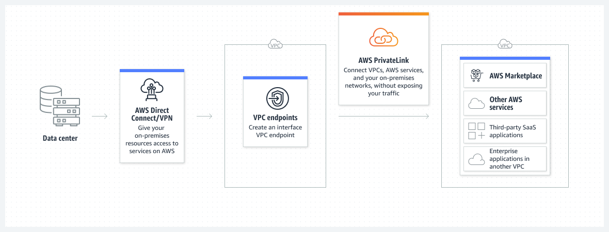

Security benefits of AWS PrivateLink:
- **Regulatory Compliance** (e.g. **HIPAA**, **PCI**) - preventing sensitive data (e.g.PII) from traversing through the internet.
- **Privately access AWS services** - connecting your VPC to AWS services privately. 
  You can configure security groups of services (e.g. ***Lambda***) on your VPC, so to control the access to the corresponding AWS services (e.g. ***Bedrock***) as well.

In addition to the security benefit, AWS PrivateLink also makes it easier to connect AWS services across different AWS accounts and VPCs to simplify your network architecture.

## How to build a GenAI application with AWS PrivateLink to Amazon Bedrock

There are many patterns to build up GenAI application with Amazon Bedrock. Let's focus on demonstration of how to establish private link with Bedrock, with ***Amazon Lambda function*** as the key component of a GenAI application.

The figure below shows the reference architecture, where the client can access to the GenAI application via AWS PrivateLink. Client can be on-premise or on AWS VPC, which can be the same or different from where the GenAI application located. Be aware that the GenAI application should be on the **same region** with the connected Amazon Bedrock endpoint. As the time of writing this blog post, Amazon Bedrock is not support in all the AWS Regions, so remember to check the [supported regions](https://docs.aws.amazon.com/bedrock/latest/userguide/what-is-bedrock.html#bedrock-regions).


 One way of building this up with the following steps:

### 1. **Create Lambda functions as part of your GenAI application interacting with Foundation Models via Bedrock**

I use this [example](https://github.com/mavi888/sam-bedrock-lambda) as a simplified GenAI application, where Lambda functions interacting with Amazon Bedrock to generate text.


### 2. **Create VPC with private subnets**

From VPC console:


Configure VPC settings:


**Note:**
  - When creating VPC, choose Tenancy with "Default", since Lambda doesn't work with "[Dedicated](https://docs.aws.amazon.com/AWSEC2/latest/UserGuide/dedicated-instance.html)" tenancy for now.
    To connect to resources in a dedicated VPC, [peer it to a second VPC with default tenancy](https://aws.amazon.com/premiumsupport/knowledge-center/lambda-dedicated-vpc/).

  - It is a good idea to have at least **2** AZs([Availability Zones](https://aws.amazon.com/about-aws/global-infrastructure/regions_az/)) and **2 subnets** considering **resilience**.

  - You have the option to choose the specific AZs. This is useful since not all AZs support **Bedrock VPC endpoint**. To identify which AZs in an [**AWS region**](https://aws.amazon.com/about-aws/global-infrastructure/regions_az/) support Bedrock VPC endpoint, run the following command.

```go
//Replace <region> with your chosen region
 aws ec2 describe-vpc-endpoint-services --service-names com.amazonaws.<region>.bedrock-runtime --region <region>
```

An example of use-east-1 like this:

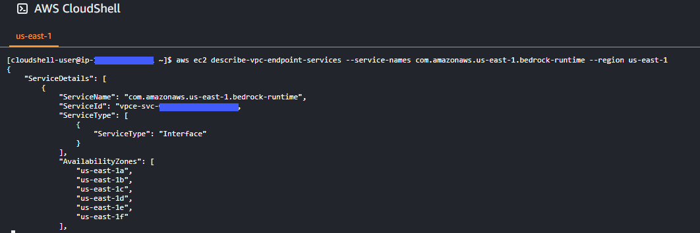


### 3. **Create Security Group in the VPC**
   
   [Security Group](https://docs.aws.amazon.com/vpc/latest/userguide/vpc-security-groups.html) controls the traffic that is allowed to reach (***inbound rules***) and leave (***outbound rules***) the resources that it is associated with.
   In this example, create a security group with inbound rule allowing **HTTPS** protocol.
   Limit the source IP addresses if you only need to allow list of specific IP address to access your application.

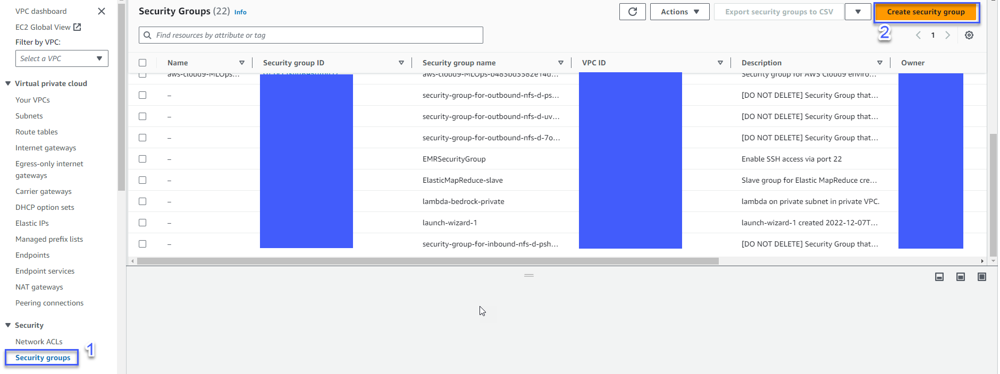

Setup inbound and outbound rules:

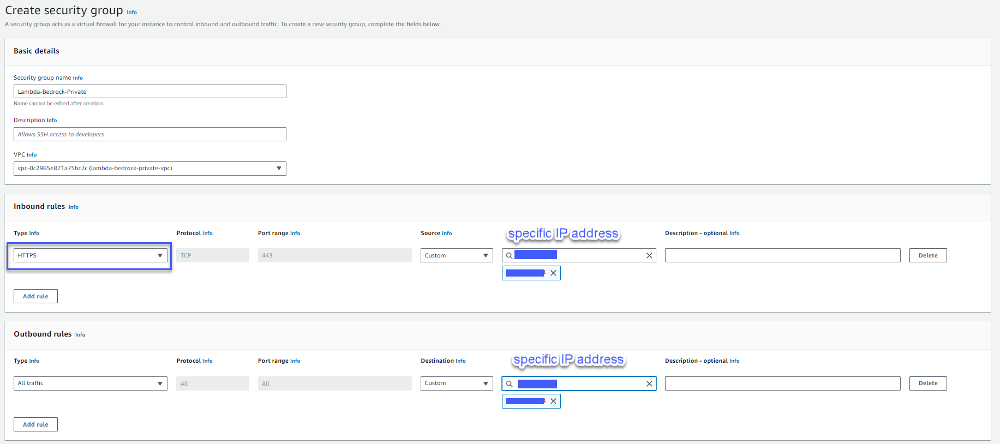

   
### 4. **Connect your Lambda functions to your VPC**

Lambda function is by default running on the Lambda service VPC with public internet access. To connect your lambda function to your own VPC, use a [Hyperplane ENI](https://docs.aws.amazon.com/lambda/latest/dg/foundation-networking.html#foundation-nw-connecting). Hyperplane ENIs provide NAT capabilities from the Lambda VPC to your account VPC. When create or update a Lambda function, Lambda allocates one Hyperplane ENI for each subnet in the function's VPC configuration.

  ***4.1. Before connecting your Lambda function to your VPC, you need to give extra permission to the lambda function's execution role***

  - Get the Lambda function's execution role:

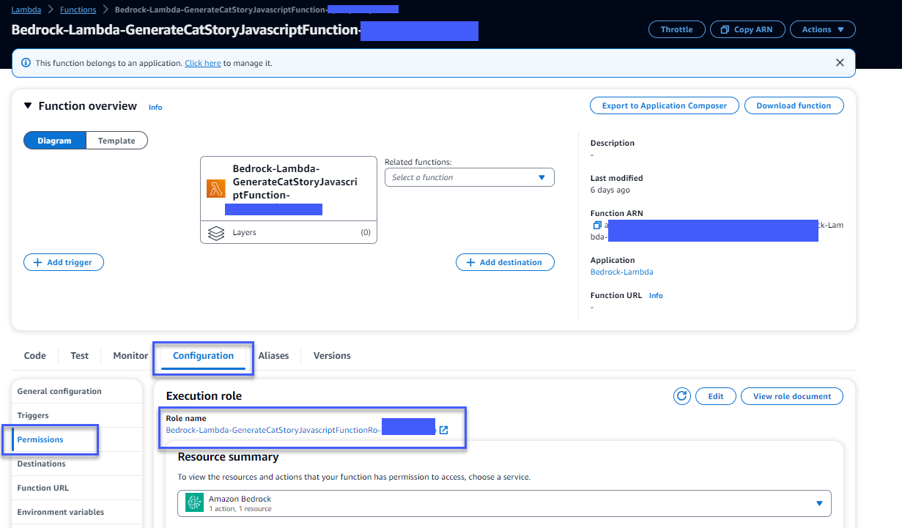


  - [AWS IAM(Identity & Access Management)](https://aws.amazon.com/iam/?nc=sn&loc=0) console, add AWS managed policy - **AWSLambdaVPCAccessExecutionRole**
 
 This role allows Lambda to do the following actions:
                "logs:CreateLogGroup",
                "logs:CreateLogStream",
                "logs:PutLogEvents",
                "ec2:CreateNetworkInterface",
                "ec2:DescribeNetworkInterfaces",
                "ec2:DeleteNetworkInterface",
                "ec2:AssignPrivateIpAddresses",
                "ec2:UnassignPrivateIpAddresses"


  ***4.2. Configure Lambda VPC access***
  
  Add the private subnets and security group to the Lambda function's VPC configuration.


Now your Lambda function is connected with your VPC. You can repeat the same steps for other Lambda functions.

### 5. **Create Bedrock VPC endpoint**

  In order to connect your VPC and Amazon Bedrock service using AWS PrivateLink, you need to create an [**interface VPC endpoint**](https://docs.aws.amazon.com/vpc/latest/privatelink/create-interface-endpoint.html#create-interface-endpoint-aws).

  From VPC console, create endpoint:

  

  Choose [Bedrock VPC endpoints](https://docs.aws.amazon.com/bedrock/latest/userguide/vpc-interface-endpoints.html) as ***"bedrock-runtime"***:

  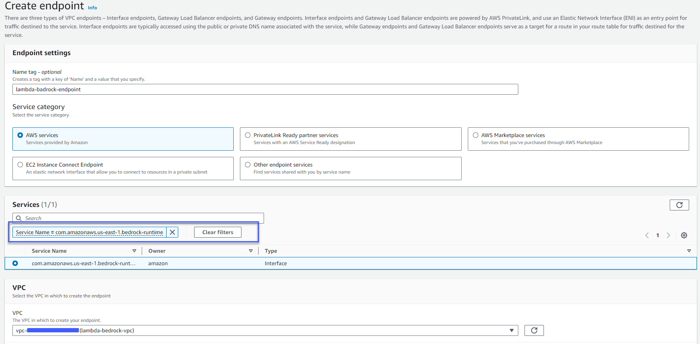

  Choose VPC and private subnets created in step 2:

  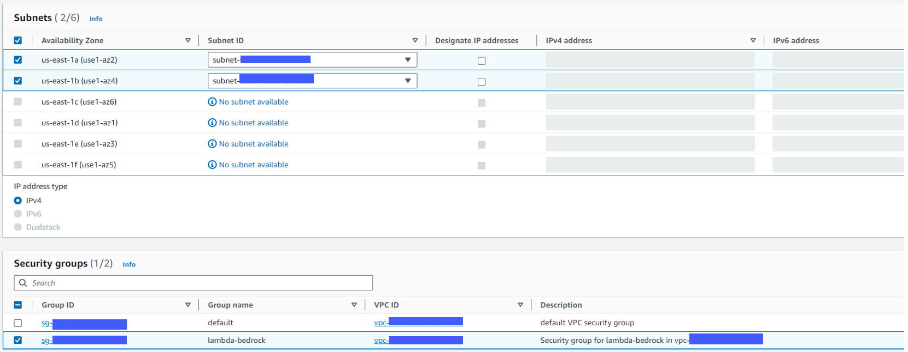

  You can further control Bedrock VPC endpoint access via [endpoint policy](https://docs.aws.amazon.com/vpc/latest/privatelink/vpc-endpoints-access.html).

```go
// An example of a custom endpoint policy, which grants access to listed Amazon Bedrock actions for all principals on all resources.
{
   "Statement": [
      {
         "Principal": "*",
         "Effect": "Allow",
         "Action": [
            "bedrock:InvokeModel",
            "bedrock:InvokeModelWithResponseStream"
         ],
         "Resource":"*"
      }
   ]
}
```

Configure endpoint policy:

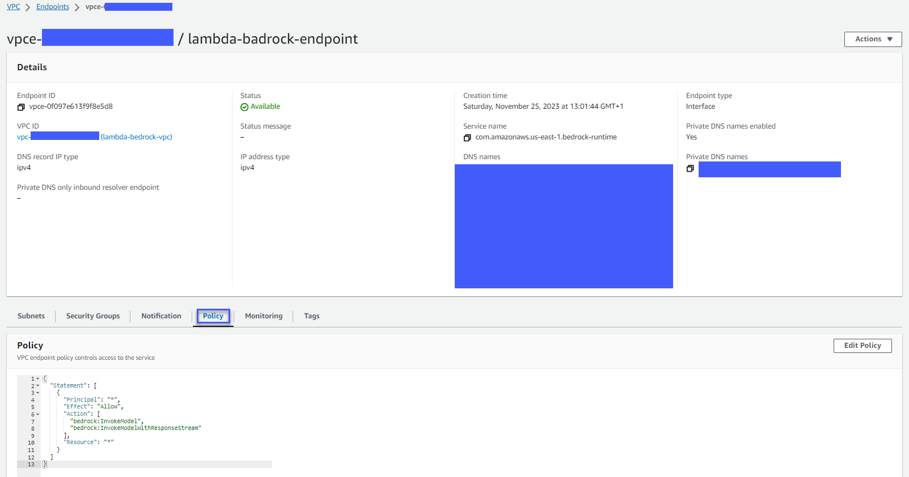


### 6. **Test your GenAI application with PrivateLink connection to Amazon Bedrock**

After all the above steps, it is time to test your GenAI application by invoking lambda functions.

Test can be executed form your client, or from Lambda console:
  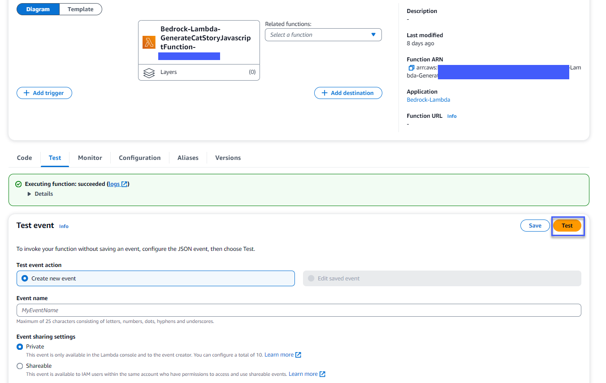

Check the response:
  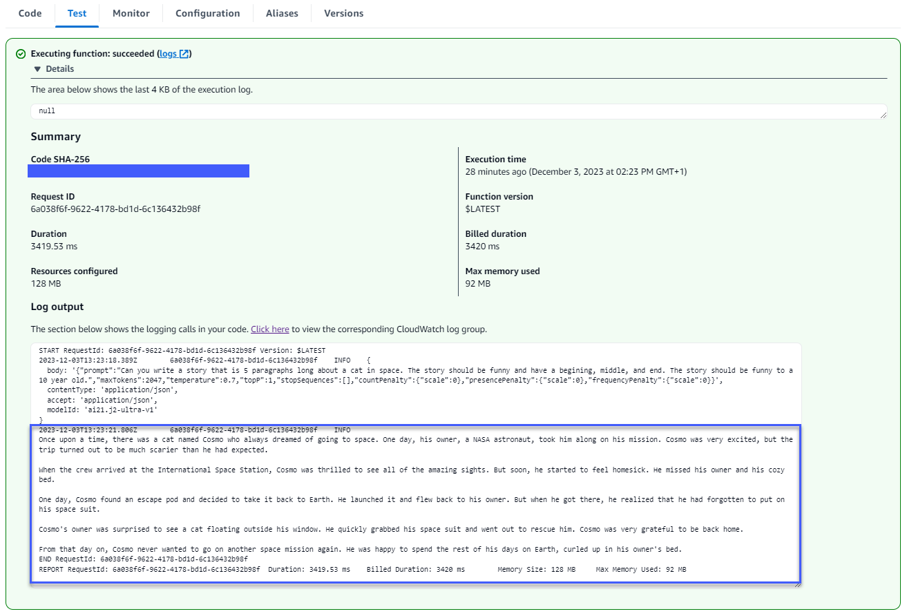

Detailed logs from Lambda function's corresponding **CloudWatch logs** are like this. This is useful for troubleshooting.
  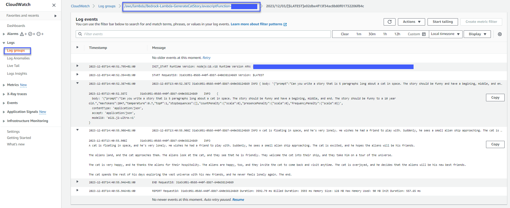


### Summary
This example is focusing on Lambda as GenAI application key component.

If your application uses additional AWS services beyond Amazon Lambda that interact with Amazon Bedrock and support VPC connections, then the same approach described in this blog can also be applied to those services.


## Conclusion

**AWS PrivateLink** is a powerful service to privately connect your VPC with **Amazon Bedrock**.
With AWS PrivateLink, you can further control who can access your application and what actions they can take via Security Group, and Endpoint Policy.

Building up your GenAI with **Amazon Bedrock**, your prompts and your data is not used in AWS's first class models or 3rd party models; data remains in the region where they were created; all the customization (fine-tuning model) you do with the model is per customer, per tenant, completely isolated, encrypted, and maintained completely separated from the models themselves.