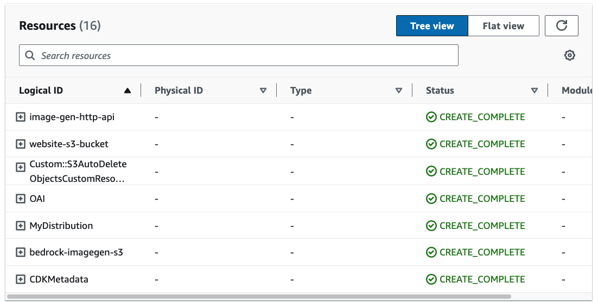
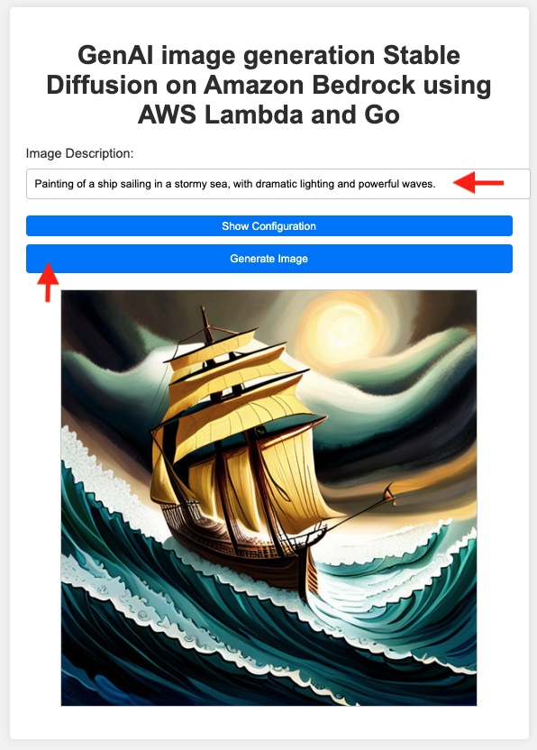

[Amazon Bedrock](https://docs.aws.amazon.com/bedrock/latest/userguide/what-is-service.html/?sc_channel=el&sc_campaign=genaiwave&sc_content=amazon-bedrock-lambda-image-gen-website&sc_geo=mult&sc_country=mult&sc_outcome=acq) is a fully managed service that makes base models from Amazon and third-party model providers (such as Anthropic, Cohere, and more) accessible through an API. 

Once the solution is deployed, users can access a static website hosted on [Amazon S3](https://docs.aws.amazon.com/AmazonS3/latest/userguide/Welcome.html/?sc_channel=el&sc_campaign=genaiwave&sc_content=amazon-bedrock-lambda-image-gen-website&sc_geo=mult&sc_country=mult&sc_outcome=acq) via [Amazon CloudFront](https://docs.aws.amazon.com/AmazonCloudFront/latest/DeveloperGuide/Introduction.html/?sc_channel=el&sc_campaign=genaiwave&sc_content=amazon-bedrock-lambda-image-gen-website&sc_geo=mult&sc_country=mult&sc_outcome=acq) domain. They can enter the image description which will be passed on to a Lambda function (via [Amazon API Gateway](https://docs.aws.amazon.com/apigateway/latest/developerguide/welcome.html/?sc_channel=el&sc_campaign=genaiwave&sc_content=amazon-bedrock-lambda-image-gen-website&sc_geo=mult&sc_country=mult&sc_outcome=acq)) which in turn will invoke [Stable Diffusion model on Amazon Bedrock](https://docs.aws.amazon.com/bedrock/latest/userguide/what-is-service.html#models-supported/?sc_channel=el&sc_campaign=genaiwave&sc_content=amazon-bedrock-lambda-image-gen-website&sc_geo=mult&sc_country=mult&sc_outcome=acq) to generate the image.


The entire solution is built using the [Go programming language](https://go.dev/) - this includes the Lambda function (using [aws-lambda-go](https://github.com/aws/aws-lambda-go) library) as well as the complete solution deployment using [AWS CDK](https://docs.aws.amazon.com/cdk/v2/guide/work-with-cdk-go.html/?sc_channel=el&sc_campaign=genaiwave&sc_content=amazon-bedrock-lambda-image-gen-website&sc_geo=mult&sc_country=mult&sc_outcome=acq)).

> The code is available on [GitHub](https://github.com/build-on-aws/amazon-bedrock-lambda-image-generation-golang)

## Pre-requisites

Before starting this tutorial, you will need the following:

- An AWS Account (if you don't yet have one, you can create one and [set up your environment here](https://aws.amazon.com/getting-started/guides/setup-environment/?sc_channel=el&sc_campaign=genaiwave&sc_content=amazon-bedrock-lambda-image-gen-website&sc_geo=mult&sc_country=mult&sc_outcome=acq)).
- [Go programming language](https://go.dev/dl/) (**v1.19** or higher).
- [AWS CDK](https://docs.aws.amazon.com/cdk/v2/guide/getting_started.html#getting_started_install?sc_channel=el&sc_campaign=genaiwave&sc_content=amazon-bedrock-lambda-image-gen-website&sc_geo=mult&sc_country=mult&sc_outcome=acq).
- [AWS CLI](https://docs.aws.amazon.com/cli/latest/userguide/getting-started-install.html?sc_channel=el&sc_campaign=genaiwave&sc_content=amazon-bedrock-lambda-image-gen-website&sc_geo=mult&sc_country=mult&sc_outcome=acq).
- [Git](https://git-scm.com/downloads).
- [Docker](https://docs.docker.com/get-docker/).

Clone this GitHub repository and change to the right directory:

```bash
git clone https://github.com/build-on-aws/amazon-bedrock-lambda-image-generation-golang

cd amazon-bedrock-lambda-image-generation-golang
```

| Attributes                |                                   |
| ------------------- | -------------------------------------- |
| ✅ AWS Level        | 200 - Intermediate                          |
| ⏱ Time to complete  | 30 minutes                             |
| 💰 Cost to complete | Free when using the AWS Free Tier      |
| 💻 Code Sample         | Code sample used in tutorial on [GitHub](https://github.com/build-on-aws/amazon-bedrock-lambda-image-generation-golang)                             |
| 📢 Feedback            | <a href="https://pulse.buildon.aws/survey/DEM0H5VW" target="_blank">Any feedback, issues, or just a</a> 👍 / 👎 ?    |
| ⏰ Last Updated     | 2023-10-27  

|ToC|
|---|

## Deploy the solution using AWS CDK

To start the deployment, simply invoke `cdk deploy`. 

```bash
cd cdk

export DOCKER_DEFAULT_PLATFORM=linux/amd64
cdk deploy
```

You will see a list of resources that will be created and will need to provide your confirmation to proceed (output shortened for brevity).


```
Bundling asset BedrockLambdaImgeGenWebsiteStack/bedrock-imagegen-s3/Code/Stage...

✨  Synthesis time: 7.84s

//.... omitted

This deployment will make potentially sensitive changes according to your current security approval level (--require-approval broadening).
Please confirm you intend to make the following modifications:

//.... omitted

Do you wish to deploy these changes (y/n)? y
```

This will start creating the AWS resources required for the application.

> If you want to see the AWS CloudFormation template which will be used behind the scenes, run `cdk synth` and check the `cdk.out` folder

You can keep track of the progress in the terminal or navigate to AWS console: `CloudFormation > Stacks > BedrockLambdaImgeGenWebsiteStack`



Once all the resources are created, you can try out the application. You should have:

- The image generation Lambda function and API Gateway.
- An S3 bucket to host the website HTML page.
- CloudFront distribution.
- And a few other components (like IAM roles, permissions, S3 Bucket policy etc.)

The deployment can take a bit of time since creating the CloudFront distribution is a time-consuming process. Once complete, you should get a confirmation along with the values for the S3 bucket name, API Gateway URL, and the CloudFront domain name.


## Update the HTML page and copy it to S3 bucket

Open the `index.html` file in the GitHub repo, and locate the following text `ENTER_API_GATEWAY_URL`. Replace this with the API Gateway URL that you received as the CDK deployment output above.

To copy the file to S3, I used the AWS CLI:

```shell
aws s3 cp index.html s3://<name of the S3 bucket from CDK output>
```

Verify that the file was uploaded:

```shell
aws s3 ls s3://<name of the S3 bucket from CDK output>
```

Now you are ready to access the website! 

## Verify the solution

Enter the CloudFront domain name in your web browser to navigate to the website. You should see the website with a pre-populated description that can be used as a prompt.

Click **Generate Image** to start the process. After a few seconds, you should see the generated image.




### Modify the model parameters

The Stability Diffusion model allows us to [refine the generation parameters](https://docs.aws.amazon.com/bedrock/latest/userguide/model-parameters.html#model-parameters-diffusion?sc_channel=el&sc_campaign=genaiwave&sc_content=amazon-bedrock-lambda-image-gen-website&sc_geo=mult&sc_country=mult&sc_outcome=acq) as per our requirements. 

The Stability.ai Diffusion models support the following controls:

- *Prompt strength* (`cfg_scale`) controls the image's fidelity to the prompt, with lower values increasing randomness.
- *Generation step* (`steps`) determines the accuracy of the result, with more steps producing more precise images.
- *Seed* (`seed`) sets the initial noise level, allowing for reproducible results when using the same seed and settings.

Click **Show Configuration** to edit these.


> Max values for `cfg_steps` and `steps` are 30 and 150 respectively.

### Don't forget to clean up

Once you're done, to delete all the services, simply use:

```bash
cdk destroy

#output prompt (choose 'y' to continue)

Are you sure you want to delete: BedrockLambdaImgeGenWebsiteStack (y/n)?
```

You were able to set up and try the complete solution. Before we wrap up, let's quickly walk through some of important parts of the code to get a better understanding of what's going the behind the scenes.

## Code walk through

Since we will only focus on the important bits, a lot of the code (print statements, error handling etc.) has been omitted for brevity.

### CDK

> You can refer to the [CDK code here](https://github.com/build-on-aws/amazon-bedrock-lambda-image-generation-golang/blob/master/cdk/cdk.go)

We start by creating the API Gateway and the S3 bucket.

```go
	apigw := awscdkapigatewayv2alpha.NewHttpApi(stack, jsii.String("image-gen-http-api"), nil)

	bucket := awss3.NewBucket(stack, jsii.String("website-s3-bucket"), &awss3.BucketProps{
		BlockPublicAccess: awss3.BlockPublicAccess_BLOCK_ALL(),
		RemovalPolicy:     awscdk.RemovalPolicy_DESTROY,
		AutoDeleteObjects: jsii.Bool(true),
	})
```

Then we create the CloudFront Origin Access Identity and grant S3 bucket read permissions to the CloudFront Origin Access Identity principal. Then we create the CloudFront Distribution:

- Specify the S3 bucket as the origin.
- Specify the Origin Access Identity that we created before.

```go
	oai := awscloudfront.NewOriginAccessIdentity(stack, jsii.String("OAI"), nil)

	bucket.GrantRead(oai.GrantPrincipal(), "*")

	distribution := awscloudfront.NewDistribution(stack, jsii.String("MyDistribution"), &awscloudfront.DistributionProps{
		DefaultBehavior: &awscloudfront.BehaviorOptions{
			Origin: awscloudfrontorigins.NewS3Origin(bucket, &awscloudfrontorigins.S3OriginProps{
				OriginAccessIdentity: oai,
			}),
		},
		DefaultRootObject: jsii.String("index.html"), //name of the file in S3
	})
```

Then, we create the image generation Lambda function along with IAM permissions (to the function execution IAM role) to allow it to invoke Bedrock operations.


```go
	function := awscdklambdagoalpha.NewGoFunction(stack, jsii.String("bedrock-imagegen-s3"),
		&awscdklambdagoalpha.GoFunctionProps{
			Runtime: awslambda.Runtime_GO_1_X(),
			Entry:   jsii.String(functionDir),
			Timeout: awscdk.Duration_Seconds(jsii.Number(30)),
		})

	function.AddToRolePolicy(awsiam.NewPolicyStatement(&awsiam.PolicyStatementProps{
		Actions:   jsii.Strings("bedrock:*"),
		Effect:    awsiam.Effect_ALLOW,
		Resources: jsii.Strings("*"),
	}))
```

Finally, we configure Lambda function integration with API Gateway, add the HTTP routes and specify API Gateway endpoint, S3 bucket name and CloudFront domain name as CloudFormation outputs.

```go
	functionIntg := awscdkapigatewayv2integrationsalpha.NewHttpLambdaIntegration(jsii.String("function-integration"), function, nil)

	apigw.AddRoutes(&awscdkapigatewayv2alpha.AddRoutesOptions{
		Path:        jsii.String("/"),
		Methods:     &[]awscdkapigatewayv2alpha.HttpMethod{awscdkapigatewayv2alpha.HttpMethod_POST},
		Integration: functionIntg})

	awscdk.NewCfnOutput(stack, jsii.String("apigw URL"), &awscdk.CfnOutputProps{Value: apigw.Url(), Description: jsii.String("API Gateway endpoint")})

	awscdk.NewCfnOutput(stack, jsii.String("cloud front domain name"), &awscdk.CfnOutputProps{Value: distribution.DomainName(), Description: jsii.String("cloud front domain name")})

	awscdk.NewCfnOutput(stack, jsii.String("s3 bucket name"), &awscdk.CfnOutputProps{Value: bucket.BucketName(), Description: jsii.String("s3 bucket name")})
```


### Lambda function

> You can refer to the [Lambda Function code here](https://github.com/build-on-aws/amazon-bedrock-lambda-image-generation-golang/blob/master/function/main.go)

In the function handler, we extract the prompt from the HTTP request body, and the configuration from the query parameters. Then it's used to call the model using [bedrockruntime.InvokeModel](https://pkg.go.dev/github.com/aws/aws-sdk-go-v2/service/bedrockruntime#Client.InvokeModel) function. Note the JSON payload sent to Amazon Bedrock is represented by an instance of the `Request` struct. 

The output body returned from Amazon Bedrock Stability Diffusion model is a JSON payload which is converted into a `Response` struct which contains the generated image as a `base64` string. This is returned as an [events.APIGatewayV2HTTPResponse](https://pkg.go.dev/github.com/aws/aws-lambda-go/events#APIGatewayV2HTTPResponse) object along with `CORS` headers.

```go
func handler(ctx context.Context, req events.APIGatewayV2HTTPRequest) (events.APIGatewayV2HTTPResponse, error) {

	prompt := req.Body

	cfgScaleF, _ := strconv.ParseFloat(req.QueryStringParameters["cfg_scale"], 64)
	seed, _ := strconv.Atoi(req.QueryStringParameters["seed"])
	steps, _ := strconv.Atoi(req.QueryStringParameters["steps"])

	payload := Request{
		TextPrompts: []TextPrompt{{Text: prompt}},
		CfgScale:    cfgScaleF,
		Steps: steps,
	}

	if seed > 0 {
		payload.Seed = seed
	}

	payloadBytes, err := json.Marshal(payload)

	output, err := brc.InvokeModel(context.Background(), &bedrockruntime.InvokeModelInput{
		Body:        payloadBytes,
		ModelId:     aws.String(stableDiffusionXLModelID),
		ContentType: aws.String("application/json"),
	})

	var resp Response

	err = json.Unmarshal(output.Body, &resp)

	image := resp.Artifacts[0].Base64

	return events.APIGatewayV2HTTPResponse{
		StatusCode:      http.StatusOK,
		Body:            image,
		IsBase64Encoded: false,
		Headers: map[string]string{
			"Access-Control-Allow-Origin":  "*",
			"Access-Control-Allow-Methods": "POST,OPTIONS",
		},
	}, nil
}

//request/response model

type Request struct {
	TextPrompts []TextPrompt `json:"text_prompts"`
	CfgScale    float64      `json:"cfg_scale"`
	Steps       int          `json:"steps"`
	Seed        int          `json:"seed"`
}

type TextPrompt struct {
	Text string `json:"text"`
}

type Response struct {
	Result    string     `json:"result"`
	Artifacts []Artifact `json:"artifacts"`
}

type Artifact struct {
	Base64       string `json:"base64"`
	FinishReason string `json:"finishReason"`
}
```

## Conclusion

In this tutorial, you used AWS CDK to deploy a serverless image generation solution that was implemented using Amazon Bedrock and AWS Lambda, and accessed using a static website on S3 via a CloudFront domain.

Happy building!