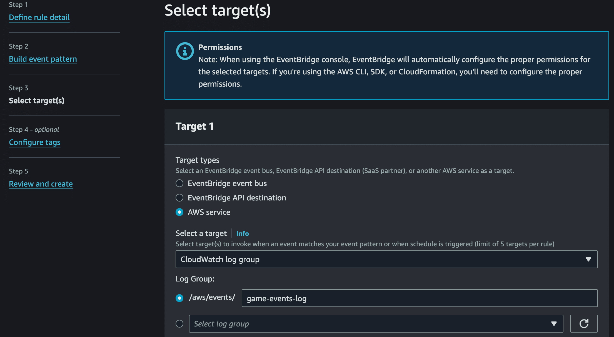
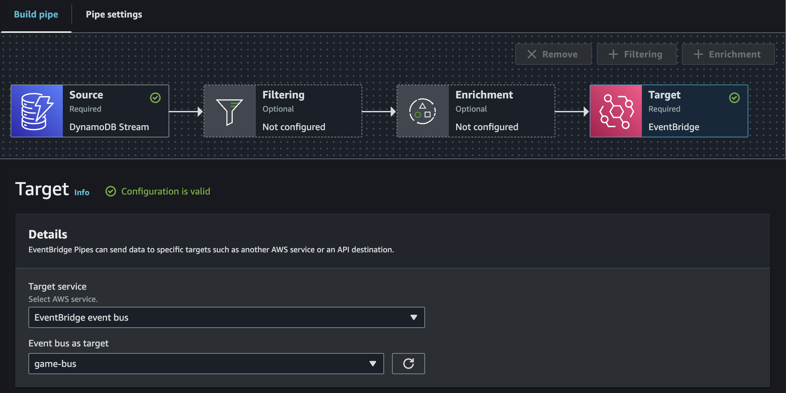
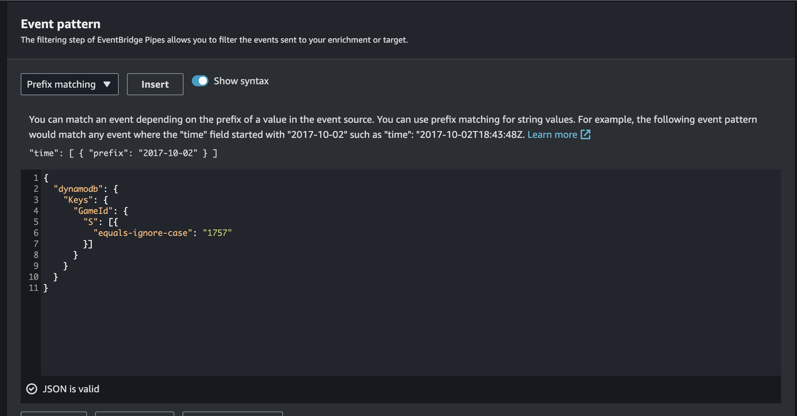
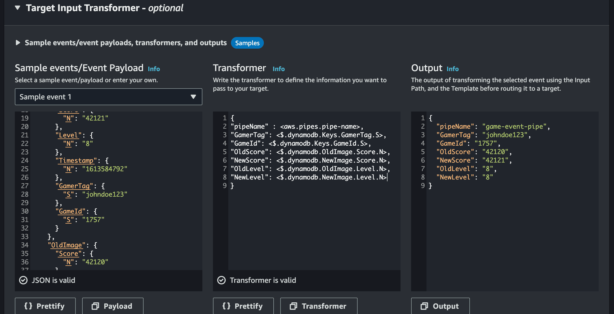

As application architectures grow in complexity, the number of events and data sources that need to integrate also increases. This often leads developers to write custom integration code which is time-consuming, difficult to maintain, and prone to errors. Amazon EventBridge Pipes aim to simplify these complex event-driven architectures by allowing different services to be connected without writing custom integration code.

## Overview

EventBridge Pipes provide a no-code way to automatically replicate events between EventBridge buses, SQS/SNS topics, and DynamoDB Streams. A [common use case for DynamoDB streams](https://aws.amazon.com/blogs/database/dynamodb-streams-use-cases-and-design-patterns/) is to detect DynamoDB table updates and publish corresponding events. Traditionally this required custom Lambda functions to stream DynamoDB events. With EventBridge Pipes, you can now implement this pattern in minutes without writing any code. However, in cases where the desired target is not in the [list of targets supported by Eventbridge Pipes](https://docs.aws.amazon.com/eventbridge/latest/userguide/eb-pipes-event-target.html), or more complex operations need to be performed during transformation such as enrichment of the data from other sources, a custom Lambda function is still necessary. That being said, Eventbridge Pipes still allows simple code-free integrations for a range of different services including [but not limited to DynamoDB streams](https://docs.aws.amazon.com/eventbridge/latest/userguide/eb-pipes-event-source.html).

This guide will walk through how to quickly set up an EventBridge Pipe that detects DynamoDB table updates and publishes events to an EventBridge bus in the AWS console. By following this simple how-to, you'll see firsthand how EventBridge Pipes can simplify complex event integrations.


### Prerequisites

All you need is an AWS account with full permissions to access DynamoDB, Eventbridge and CloudWatch Logs.

| Attributes                |                                   |
| ------------------- | -------------------------------------- |
| ✅ AWS Level        | Intermediate - 200                         |
| ⏱ Time to complete  | 45 minutes                             |
| 💰 Cost to complete | USD $0.01      |
| 🧩 Prerequisites    | [AWS Account](https://aws.amazon.com/resources/create-account/)|
| 📢 Feedback            | <a href="https://pulse.buildon.aws/survey/DEM0H5VW" target="_blank">Any feedback, issues, or just a</a> 👍 / 👎    |
| ⏰ Last Updated     | 2023-11-14                             |

## Walkthrough

### Step 1: Creating a DynamoDB Table and enabling streams

First, login to the AWS Management Console and navigate to the DynamoDB service. Click on "Create Table" to begin setting up the new table.

For Table name, enter "GameScores". For the Primary key, enter "GameId" for the partition key and "GamerTag" for the sort key. These will be used to uniquely identify each item in the table.

Under Table settings, we can customize read/write capacity as needed for our expected workload. The defaults are fine to start.

The default settings are left for the key attributes GameId and GamerTag.


Once all fields are entered, scroll down and click "Create" to finish creating the GameScores table. The table will be ready to store game score data with the specified schema.

You can now start inserting items into the table through the console, SDKs, or other AWS services. Make sure the items contain the configured partition key and sort key. The other attributes like Score, Level, and Timestamp will be optional.

To enable streams on the table, in the DynamoDB console select the "GameScores" table and go to the "Exports and Streams" tab. Scroll all the way down to "DynamoDB stream details" and click "Turn on". In the view, select "New and old images" for Stream view type and check Stream enabled. Choose the shard count based on expected workload. Scroll down and click "Enable" to activate streams. The stream ARN can now be used by applications to process changes.

Keep in mind that enabling streams does not consume any read or write capacity units (RCUs or WCUs), and so will not affect the performance of the table. However, the data in the streams is stored in shards, and this storage is something that is charged seperately from the table charges. You also pay for accessing the stream records. If you enable streams on an on-demand capacity mode table, you pay per request for the stream records. If the table uses provisioned capacity, stream requests are free but you pay for shard storage and data transfer. Stream records are kept for 24 hours by default. So shards will accumulate over time as records expire. Make sure to delete the table when no longer needed to stop incurring shard storage charges.


### Step 2: Create a custom event bus in Amazon Eventbridge

First, open the Amazon EventBridge console in AWS. In the left navigation pane, click "Event Buses". On this page, click the "Create event bus" button. Custom event buses allow for greater isolation, access control, organization, separation of concerns, event retention control, and insulation from changes compared to using the shared default event bus. This is because the default event bus receives events from all AWS services.

Give the event bus the name "game-bus". The name can contain up to 256 characters and must be unique within the account. You can enable archive events here if desired. Click "Create".

Now we will create a rule that sends all events from that bus into a CloudWatch log group so that we can see the events published to it. Go to "Rules" on the left hand side and once there, change the event bus from the default one to "game-bus".


Click on "Create Rule" and for a rule name, enter "all-game-events". Optionally enter a description. Make sure the event bus selected is "game-bus".


After going to the next step, click on "All Events" as the event source. This may display a warning (as displayed in the image below) but we do want to have visibility into whatever events are sent to the bus. The warning is shown because rules are generally used to filter events coming into the Event bus, and our rule is doing no filtering. You may create rules that performs filtering but for this example we will perform filtering prior to adding the event to the event bus. This rule is just to have visibility into the event bus. We can leave everything else in this step as is and continue.


For the target, select "AWS service" and for the target, from the dropdown select "CloudWatch log group". Name the log group "game-events-log". Note that if we use infrastructure as code, we would additionally need to configure an IAM role to allow Eventbridge to access this log group.



Now we can skip the tagging part and go straight to creating the rule.


Once the rule is created, we can navigate to it in the console under the "Rules" section. Then, if we navigate to the "targets" tab on the lower side of the page, we can then click the link that says "game-events-log" to navigate to the created log group in CloudWatch. Here, we can see a log of all the events sent to the event bus. We can click on "Start tailing" on the top right hand side to see the incoming events. It is highly recommended to leave this tab open as we will return later.

### Step 3: Creating the pipe

We will now create the Eventbridge Pipe. Eventbridge Pipes are a simple, no-code integration service that connects sources to targets. Pipes also supports more advanced capabilities including transformations as well as enrichments using an API, a Step Function or a Lambda function. We will use Pipes to read data from the DynamoDB stream and write it to the custom event bus we created in the last section.

To create the Eventbridge Pipe, we can click on "Pipes" on the left hand side of the Eventbridge console, and click on "Create Pipe". In the name field, we can use "game-event-pipe". For the source, we want to use the DynamoDB stream we previously created. The starting position can be left as "Latest". We could also optionally configure additional settings pertaining to batching if we want to process multiple items at once, but for now we will leave these settings as they are.


Now for the target, we can select our "game-bus" event bus. Now we are ready and can click on "Create Pipe". Now we will test the pipe by creating an item in the DynamoDB Table.



### Step 4: Testing the integration

To test the integration, we can once again navigate to our table in the DynamoDB console. We can do that by going back to the "Tables" page on the console and click on our table called "GameScores". Then we can click on "Explore Table Items" in the top right hand side and after scrolling down click on "Create Item". Then create the item, using the "JSON view" and disabling "View DynamoDB JSON". We can create this item as a sample:

```json
{
  "GameId": "1757",
  "GamerTag": "johndoe123", 
  "Score": 42120,
  "Level": 8,
  "Timestamp": 1613584792
}
```


After creating this item, we can then go to the CloudWatch Logs Live Tail, and see that the item is sent to the CloudWatch log group. This is super powerful, as the item had to traverse the stream, into the Eventbridge Pipe, through the event bus, and passed through the Eventbridge Rule in order to get here!


### Optional: Filtering and transforming the payload

If we wanted to transform the item before sending it, or filter out which events to send to the event bus so that only particular events are sent to the event bus. Filtering could be used, for example, if the event bus is only meant for a particular game then we don't want to send unnecessary events to the event bus. Keep in mind that Eventbridge rules can also filter out events, so it is up to us to determine whether the event should be filtered before it is sent to the bus (through the pipes integration) or after.

To perform filtering, we may go back to the "game-event-pipe" in the Eventbridge Pipes section of the Eventbridge console. Then, we can click on "Edit" on the top right hand side to edit the pipe. Then clicking on the "Filtering" icon on the pipe should get us the ability to add a filtering statement. Copy the following event pattern into the box that says "Event Pattern" near the bottom of the page. This event pattern follows the same pattern as the expected event except for the fact that the value is replaced by an array detailing the kind of value that is expected. In this case, we case-insensitively expect the string "1757" for the GameId string.

```json
{
  "dynamodb": {
    "Keys": {
      "GameId": {
        "S": [ { "equals-ignore-case": "1757" } ]
      }
    }
  }
}
```



Now that we configured filtering, let's transform the payload using the "Target Input Transformer". To do this, click on the "Target" Icon on the pipe diagram and scroll down. Close to the bottom there is a dropdown called "Target Input Transformer", which should be expanded. Paste the following transformer in the middle column:

```
{
    "pipeName" : <aws.pipes.pipe-name>,
    "GamerTag": <$.dynamodb.Keys.GamerTag.S>,
    "GameId": <$.dynamodb.Keys.GameId.S>,
    "OldScore": <$.dynamodb.OldImage.Score.N>,
    "NewScore": <$.dynamodb.NewImage.Score.N>,
    "OldLevel": <$.dynamodb.OldImage.Level.N>,
    "NewLevel": <$.dynamodb.NewImage.Level.N>
}
```

An [input transformer](https://docs.aws.amazon.com/eventbridge/latest/userguide/eb-pipes-input-transformation.html) object looks syntatically similar to a JSON document, except for the fact that the dynamic values inside the "<>" tags are replaced by the values from the event and metadata from the pipe, such as the pipe name. Hence, these do not use quotes. Static values can also be inserted with the usual JSON syntax.



If you like, you can try pasting a sample event from CloudWatch Logs on the right hand side column to see how the event would get transformed. This should take information from the item, as well as metadata from the pipe and transform the event before it is sent to the event bus. Now we can click "Update pipe" on the top right hand side.

We can now play around with the Table to see how the events get recorded. Navigate to the DynamoDB table and change the fields in the old item we placed in the table, like how we did in the previous section. Notice how it got sent because the filtering statement matched the GameId. How about if we create another item with another GameId? We see that gets filtered out. Now any new event that gets sent through Pipes will now get transformed to a format that looks similar to this one, instead of one that looks like the default output of a DynamoDB stream:

```json
{
    "version": "0",
    "id": "8b5b7650-5f62-128b-4ca4-18e06ff9e4bb",
    "detail-type": "Event from aws:dynamodb",
    "source": "Pipe game-event-pipe",
    "account": "AWS_ACCOUNT_ID",
    "time": "2023-11-12T15:01:02Z",
    "region": "eu-west-1",
    "resources": [],
    "detail": {
        "pipeName": "game-event-pipe",
        "GamerTag": "johndoe123",
        "GameId": "1757",
        "OldScore": "42122",
        "NewScore": "42123",
        "OldLevel": "8",
        "NewLevel": "9"
    }
}
```

We have now learned how to transform and filter the inputs.

## Clean-up

To clean-up your AWS account, remember to delete the following:

* The CloudWatch log group in the CloudWatch Console
* The Eventbridge pipe, as well as the custom bus and the rule.
* The DynamoDB Table. This will automatically delete the stream. Make sure to not check the box for "Create an on-demand backup of GameScores before deletion."

## Conclusion

Through this step-by-step guide, we created an end-to-end serverless event pipeline using Amazon EventBridge Pipes. By simply pointing and clicking in the AWS Management Console, we set up a Pipe that streams DynamoDB table update events to an EventBridge event bus. This removes the need to write any custom integration logic in Lambda, allowing us to focus on application functionality.

Pipes simplified several key tasks for our use case: capturing DynamoDB events, routing events to the target EventBridge bus, and optionally filtering and transforming the event payload.

By leveraging EventBridge Pipes for event ingestion and integration, we can quickly connect various services and data sources without managing complex application code. Pipes provide a no-code way to implement event streaming and transformation in our serverless architectures. Going forward, we can spend less time on glue code and more time focusing on core product capabilities.
