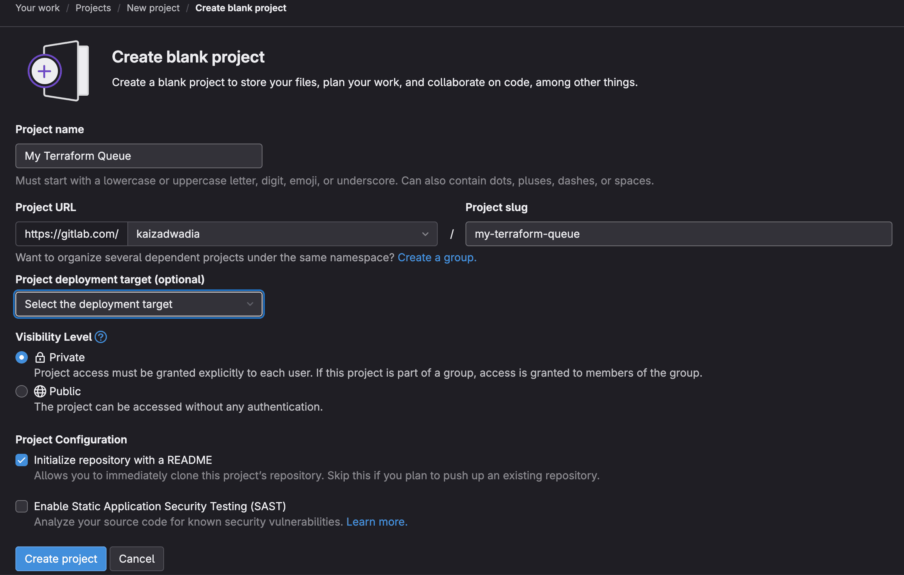
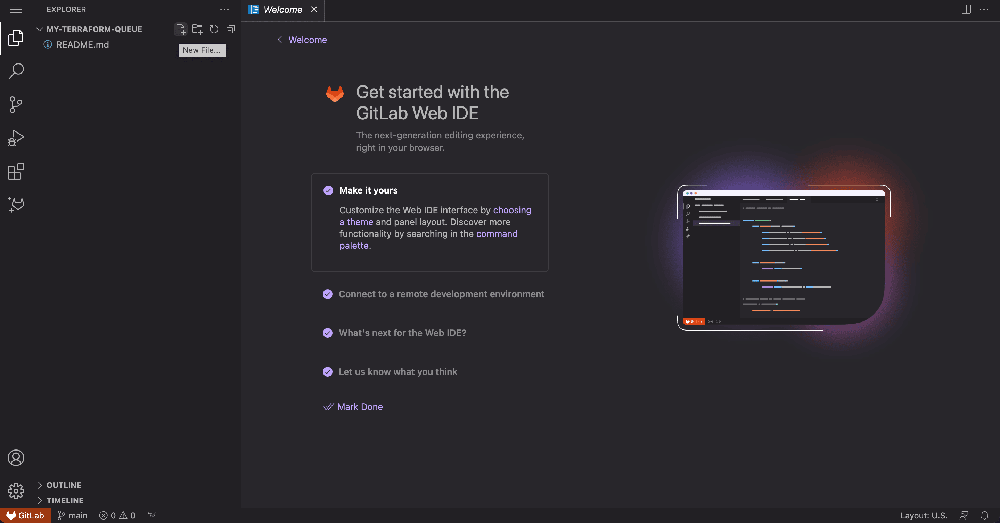
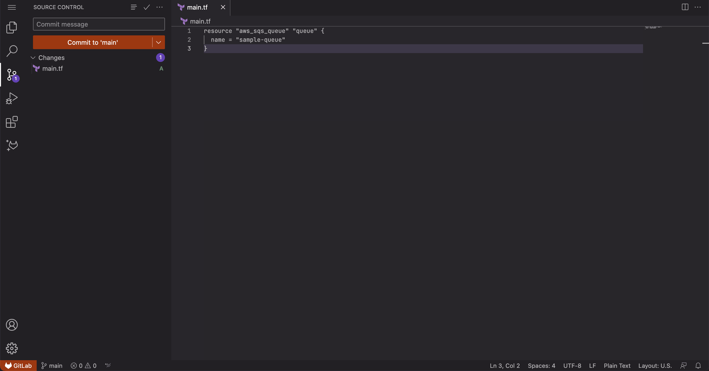
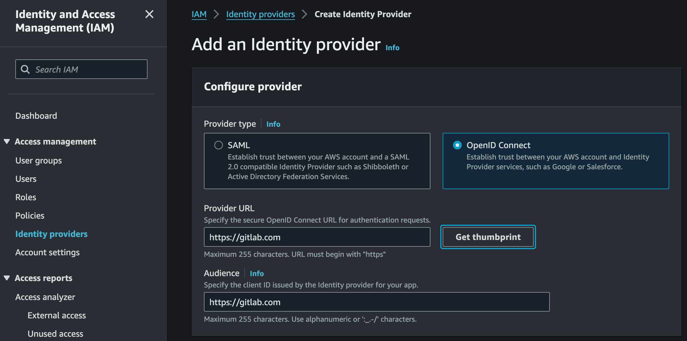
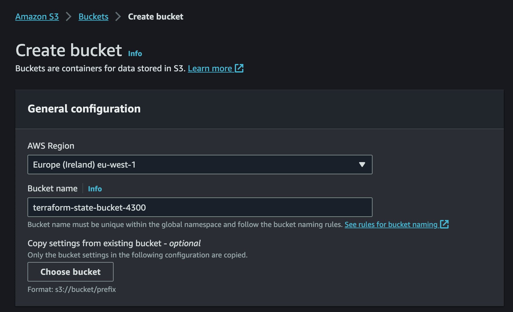
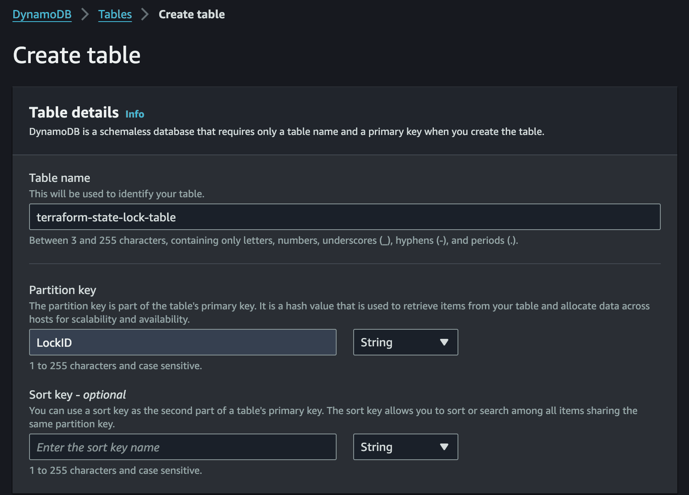
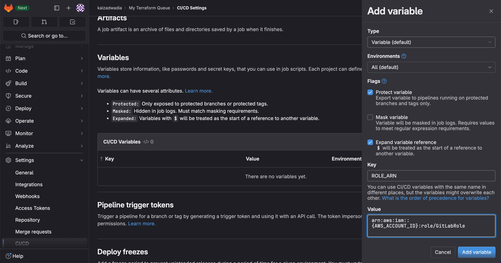
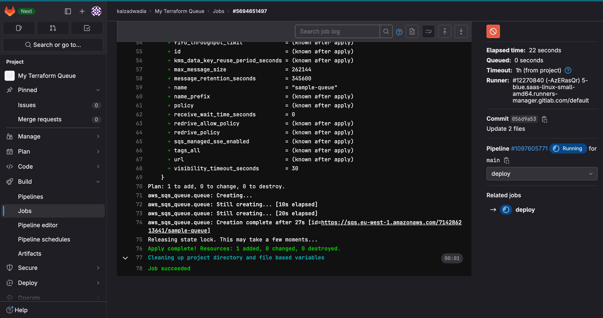

Deploying infrastructure to AWS manually can be time-consuming and prone to errors. In this post, we'll go over how to set up a CI/CD pipeline for automated AWS deployments using GitLab and Terraform.

## Overview

First, we'll write a Terraform script to deploy AWS resources and a matching .gitlab-ci.yml file to execute the script on commit.

We'll configure the necessary permissions in AWS IAM to allow GitLab to create infrastructure. We'll also create an S3 bucket and DynamoDB table to store remote Terraform state.

Finally, we'll test the pipeline by deploying sample infrastructure.

By following this guide, you'll learn infrastructure-as-code best practices for GitLab and Terraform and have an automated deployment pipeline to AWS ready for your infrastructure repos. Let's get started on setting up smooth AWS deployments with GitLab and Terraform.

### Prerequisites

You need an AWS account and a GitLab (free trial) account. Note that the steps in this tutorial will be different if you choose to use a self-managed GitLab account. This difference is mainly applicable to [the second step](#configure-an-identity-provider-in-iam).

| Attributes                |                                   |
| ------------------- | -------------------------------------- |
| ✅ AWS Level        | Intermediate - 200                         |
| ⏱ Time to complete  | 45 minutes                             |
| 💰 Cost to complete | Free Tier Eligible      |
| 🧩 Prerequisites    | [AWS Account](https://aws.amazon.com/resources/create-account/) and [GitLab Account](https://gitlab.com/-/trial_registrations/new?glm_source=about.gitlab.com/&glm_content=default-saas-trial)|
| 📢 Feedback            | <a href="https://pulse.buildon.aws/survey/DEM0H5VW" target="_blank">Any feedback, issues, or just a</a> 👍 / 👎    |
| ⏰ Last Updated     | 2023-12-20                             |

## Walkthrough

### Build the Repository

In [GitLab](https://gitlab.com), create a new repository to store our Terraform script by clicking on "New project" on the top right side of the page. Then click on "Create blank project". For the project name, enter "My Terraform Queue" and for the group (the first part of the project URL), we can select our username (for me that would be kaizadwadia). The project slug should be generated automatically while for the rest of the fields, the default options are sufficient.



Once we click on "Create Project" we should be navigated to the home page of our repository. To make changes to the repository we will use the Web IDE, which is essentially a web-based VSCode. To open that, we can click on the "Edit" dropdown on the right side of the screen to the left of the "Code" button, and select "Web IDE". The IDE should open in another browser tab. 

We will now create our Terraform file. Click on the "New File" icon which is on the top left-hand side of the screen and should appear when the cursor is over the repository name. This can also be done by right clicking on the left side of the screen underneath the "README.md" file and clicking "New File".



Then we can give our file a name. I choose "main.tf" for the file name, which upon pressing enter, will open the file. Let's add the code for the SQS Queue that we want to create.

```hcl
resource "aws_sqs_queue" "queue" {
  name = "sample-queue"
}
```

Now we can save this code by pressing Ctrl + s (Cmd + s on Mac) and commit the code to the main branch by going to the source control tab on the sidebar (third from the top) and clicking "Commit to 'main'". If a warning pops up we can override it by clicking "Continue" instead of creating a new branch.



We will come back to modify this code later. For now, let's move on to allowing GitLab to modify resources in our AWS account.

### Configure an Identity Provider in IAM

We will now configure GitLab as an identity provider for IAM. This allows IAM to recognize GitLab as a trusted entity that we can assign permissions via an IAM Role.

To do this, navigate to IAM in the AWS Management Console, and then click on "Identity Providers" on the sidebar under "Access Management". After that, click on the button saying "Add provider" on the top right-hand side. Once there, enter the information as displayed in the below image.



Make sure that the option for OpenID Connect is selected on the top, this is because OpenID Connect allows you to configure trust relationships with third party accounts including but not limited to GitLab. Also ensure that the provider URL is GitLab's root URL, `https://gitlab.com` as well as the Audience. The provier URL is the URL from which the OpenID configuration is obtained. You can view it yourself by navigating to [`gitlab.com/.well-known/openid-configuration`](gitlab.com/.well-known/openid-configuration). *Note that if you are using a self-managed instance of GitLab (that is publicly available on the internet) you would need to use the root URL of that instance instead of gitlab.com. In this case, check that your instance supports OpenID connect by navigating to the OpenID configuration URL using your instance's root domain.*

Once you have completely filled out the information, you can click on "Get thumbprint" to retreive the thumbprint from the URL you supplied. [This page](https://docs.aws.amazon.com/IAM/latest/UserGuide/id_roles_providers_create_oidc_verify-thumbprint.html) in the documentation describes how this thumbprint is obtained. Then click on "Add provider". We have now configured GitLab as an Identity Provider in our AWS Account.

### Create an IAM Role for GitLab CI

To create an IAM Role that our CI/CD pipeline can assume to make deployments click on "Roles" under "Access Management" in the IAM page and then click on the "Create role" button on the top right of the page. In the first step, configuring the trusted entity means providing access to our identity provider we created before. For this, select on "Web identity", which should allow you to select "gitlab.com" as the identity provider from the dropdown menu and "https://gitlab.com" as the audience, similar to the below image.


Once that is done, clicking "next" should allow us to select IAM policies which determine what permissions GitLab should have. For the purposes of this tutorial, we will provide full access only to three services: S3, DynamoDB and SQS by attaching the following policies:

* AmazonS3FullAccess
* AmazonDynamoDBFullAccess
* AmazonSQSFullAccess

Once we have selected the appropriate policies, we can move on to the next step, which allows us to give the role a name and description. The role name should be "GitLabRole" and the description of the role is "An IAM Role to give GitLab CI access to deploy to AWS". We can now scroll down to the bottom and click on "Create role".

Once the role is created, navigate to it in the console under "Roles" by searching for the role name and clicking on it. Once the role is on the page, select the "Trust relationships" tab and click on "Edit trust policy" on the right side of the page. Edit the condition in the trust policy to something like this:

```json
{
  "StringLike": {
    "gitlab.com:sub":"project_path:{GITLAB_GROUP}/{GITLAB_PROJECT}:ref_type:branch:ref:{GITLAB_BRANCH}"
  }
}
```

Replace `{GITLAB_GROUP}` with your username (eg. `kaizadwadia`), `{GITLAB_PROJECT}` with your project slug (ie. `my-terraform-queue`), and `{GITLAB_BRANCH}` with `main`. This will ensure that only pipelines running on the main branch of the specific repository has permissions to assume this role. Moreover, note that while the "StringEquals" condition would work here, we can also use wildcards like "*" to signify that any branch could have permissions with the "StringLike" condition. This allows for more complex permissions assignments such as allowing any repository under your username to assume this role. The trust policy should now look like this:

```json
{
  "Version": "2012-10-17",
  "Statement": [
    {
      "Effect": "Allow",
      "Principal": {
        "Federated": "arn:aws:iam::{AWS_ACCOUNT_ID}:oidc-provider/gitlab.com"
      },
      "Action": "sts:AssumeRoleWithWebIdentity",
      "Condition": {
        "StringLike": {
          "gitlab.com:sub": "project_path:kaizadwadia/my-terraform-queue:ref_type:branch:ref:main"
        }
      }
    }
  ]
}
```

Upon clicking "Update Policy" the role should be ready for use by GitLab CI. Note the Role ARN which is available on this page, as it will be used in a [later step](#write-the-instructions-for-the-cicd-pipeline).

### Create the AWS Resources Manage Terraform State

When creating resources with Terraform, files are created to manage the state of the infrastructure created by Terraform. Terraform state is a file that tracks the infrastructure that Terraform has created. It maps real-world resources to what is defined in your Terraform configuration files. The state file allows Terraform to determine what infrastructure needs to be created, updated, or destroyed based on the desired configuration.

State lock is a mechanic that prevents multiple Terraform commands from accessing and trying to modify the state at the same time. When you run a Terraform command, it will acquire a lock on the state so that no other commands can access it. This prevents race conditions where two commands try to update the state simultaneously in an unsafe way. Once the command finishes, it releases the lock so other commands can run.

We will create an S3 Bucket to house the state file, and a DynamoDB Table to host the state locking mechanism. Both will be done in the "eu-west-1" region for this tutorial. To create the S3 Bucket, head over to the S3 page in the AWS Console and click "Create Bucket" on the right side. Give the bucket a globally unique name, such as "terraform-state-bucket-XXXX" (where XXXX is a random sequence of digits).



Now to create a DynamoDB Table, we can visit the DynamoDB page on the AWS Console, and click on "Create table" on the right side of the page. Make sure it is done in the same region as the S3 Bucket. For the table name, we can give it "terraform-state-lock-table". We can call the Partition Key "LockID", and have it be a string.



We can leave the rest as the default settings and click on "Create table". We have now completed the setup for state management. Now we will write the instructions in GitLab on how to deploy a Terraform script to AWS.

### Write the Instructions for the CI/CD Pipeline

Before we write the instructions for the CI/CD Pipeline we need to give the Role ARN to the Pipeline in the form of a secret variable so that our code repository does not have the name of the IAM role we are assuming. To do this, head over to the home page of the GitLab repository that we created in the [first step](#build-the-repository), and click on "CI/CD" under the "Settings" dropdown menu on the very bottom of the sidebar. Then click "Expand" on the "Variables" section and click on "Add variable". Have the Key be "ROLE_ARN" and the value be the ARN of the Role that was saved in the [third step](#create-an-iam-role-for-gitlab-ci).



All the other fields can be left as is and once "Add variable" is clicked on the bottom right-hand side, this variable is saved. Repeat this process once again for the region, saving it with the key, "AWS_DEFAULT_REGION" and the value should be the region you want to deploy the SQS queue to. In this case, I am making it the same region, "eu-west-1".


To write the instructions used by the instructions the CI/CD Pipeline to run our Terraform script we will create a `.gitlab-ci.yml` file in the root of our repository. See the [first section](#build-the-repository) on how to create and edit files using the Web IDE in GitLab. Once we have created the `.gitlab-ci.yml` file, we will add the following stage to it:

```yaml
stages:
  - deploy

deploy:
  stage: deploy
  only:
    - main
  image: 
    name: hashicorp/terraform:light
    entrypoint: [""]
  id_tokens:
    GITLAB_OIDC_TOKEN:
      aud: https://gitlab.com
  before_script:
    - echo "${GITLAB_OIDC_TOKEN}" > /tmp/web_identity_token
    - mkdir ~/.aws
    - echo -e "[profile oidc]\nrole_arn=${ROLE_ARN}\nweb_identity_token_file=/tmp/web_identity_token" >> ~/.aws/config
  script:
    - terraform init
    - terraform apply -auto-approve
```

What this does, is creates a stage called "deploy" that only runs when commited to the 'main' branch, using the Terraform light Docker image. The secret sauce is the ID token which is the web identity token used to assume the IAM Role we created earlier in the [third step](#create-an-iam-role-for-gitlab-ci). In the `before_script`, we are performing the configuration used to assume the role with the web identity token and saving it under the profile called "oidc". Profiles in the AWS CLI allow you to configure and store credentials and settings for different AWS accounts or IAM users, keeping them separate and switching between them easily. By using a named profile instead of default credentials, you can easily manage multiple environments, accounts, and credentials without having to repeatedly configure them. Save this file, and in the next section, we will bring everything together and deploy the code to AWS.

### Deploy the Script

Now in the Web IDE, go back to the "main.tf" file we created earlier, and add the following code above the definition of the SQS Queue:

```hcl
# Configure backend for state management
terraform {
  backend "s3" {
    bucket         = "terraform-state-bucket-XXXX"
    key            = "statefile.tfstate"
    dynamodb_table = "terraform-state-lock-table"
    encrypt        = true
    profile = "oidc"
  }
}

# Configure the AWS Provider
provider "aws" {
  profile = "oidc"
}
```

Make sure you replace "XXXX" with the actual name of the S3 Bucket you created earlier. Note that the profile "oidc" is the same as the profile created by the pipeline, so that the Terraform script knows the role to assume while provisioning the resources. The same applies with the profile for the provider. Note that these two don't necessarily need to be the same, so you could use one role for accessing the backend and another for deploying the resources. The "key" parameter in the backend denotes the name of the file that is created to manage the Terraform state in the S3 Bucket. The "encrypt" parameter determines whether [SSE-S3](https://docs.aws.amazon.com/AmazonS3/latest/userguide/UsingServerSideEncryption.html) is used to encrypt the file in the Bucket.

Once we have this written, commit this to the repository using the same method we used in the [first step](#build-the-repository). As soon as we do so, our pipeline should start automatically upon committing our code to the main branch. We can see it through GitLab if we go back to our repository's home page and click on "Jobs" under the "Build" dropdown menu on the sidebar.



If everything goes as planned we should see that our Queue has been created in the pipeline's logs, as well as in the AWS Console if we navigate to the SQS page.

## Clean-up

To clean-up your AWS account, remember to delete the following resources:

* The SQS Queue created by Terraform
* The S3 Bucket called "terraform-state-bucket-XXXX"
* The DynamoDB Table called "terraform-state-lock-table"
* The IAM Role, "GitLabRole" and Identity Provider, "gitlab.com".

## Conclusion

And that's it! We've set up an automated AWS deployment pipeline using GitLab and Terraform best practices. Now anytime you push changes to your infrastructure code, GitLab CI will trigger Terraform to deploy those changes to AWS.

In this post we covered configuring IAM permissions and roles for GitLab, creating S3 and DynamoDB resources to store remote state, writing a Terraform script to deploy infrastructure, setting up a .gitlab-ci.yml pipeline to execute on commits, and testing our automated deployments.

By following these steps, you can take the manual work and errors out of deploying to AWS. Your infrastructure becomes code that can be treated like any other application code.

As you expand your infrastructure, be sure to continue using security best practices like least privilege IAM roles. And leverage GitLab's power with features like the Terraform template library.

Now whenever inspiration strikes, you can implement and deploy new AWS infrastructure automatically in a fraction of the time. You're ready to use GitLab and Terraform to streamline your cloud deployments!
