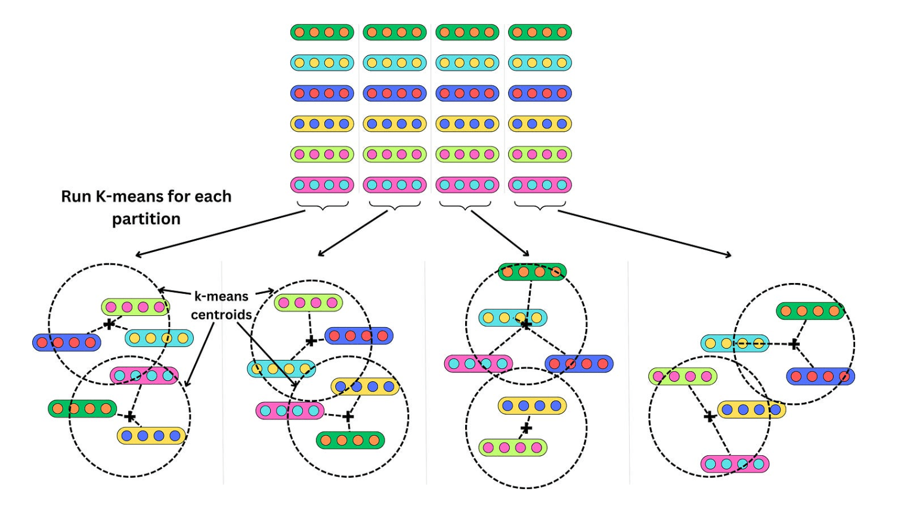
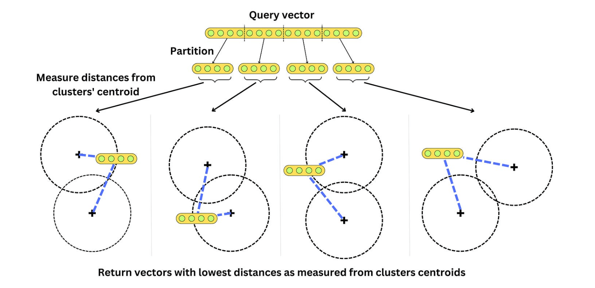
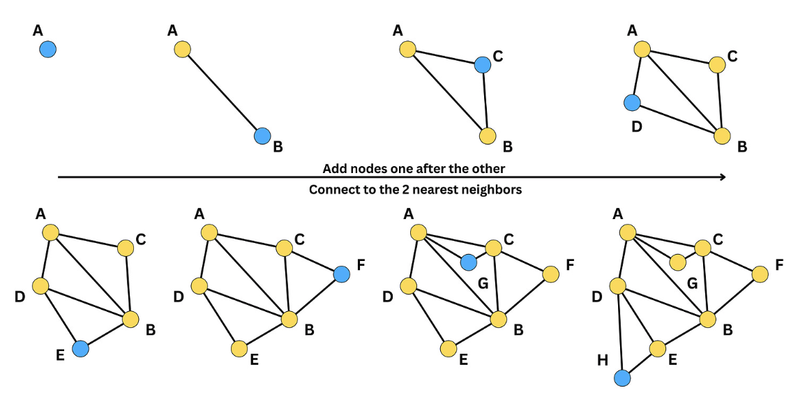
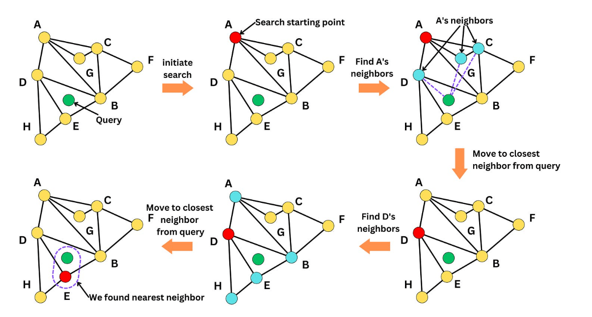

## What’s this Vector Buzz?

Ever wondered how apps suggest songs like those on Amazon Music, or products that perfectly match your taste on Amazon.com? Dive into the world of vector databases, where data isn't just stored in tables and rows but is mapped as geometric points in space.


In the rapidly evolving landscape of data engineering and machine learning, the concept of vector embeddings has emerged as a cornerstone for a myriad of innovative applications. As we navigate through the era of generative AI and large language models (LLMs), the need to understand and leverage these embeddings has become more crucial than ever. This blog post aims to demystify the world of vector embeddings and shed light on how they are transforming the way we handle and interpret vast amounts of data.

Through this post, we will embark on a journey to understand the nuts and bolts of vector embeddings and how we can store those embeddings in a vector store using Amazon Bedrock, Amazon Aurora and LangChain. From understanding the basic concept of an embedding to exploring advanced vector storage techniques and indexing methods, we will cover all the essential aspects that make vector embeddings an indispensable tool in modern data engineering and machine learning.

This marks the beginning of our two-part blog series. In this first installment, we delve into the fundamentals of vector embeddings. We'll explore what embeddings are, why they're crucial in the realm of AI, and delve into the methods of storing and indexing them. This foundational understanding sets the stage for Part 2, where we'll navigate the various vector storage solutions available on AWS. Here, we'll discuss how to effectively store your embeddings and utilize them in conjunction with Large Language Models (LLMs) to create robust, AI-powered applications. Additionally, we will introduce and leverage `LangChain`, an [tool](https://python.langchain.com/docs/get_started/introduction) that enhances our journey into the practical application of these concepts, demonstrating how to seamlessly integrate these technologies into real-world AI solutions.


## Embeddings

Let's start with the basics: what is an **embedding**? An embedding is a numerical representation of content in a form that machines can process and understand. The essence of the process is to convert an object, such as an image or text, into a vector that encapsulates its semantic content while discarding irrelevant details as much as possible. An embedding takes a piece of content, like a word, sentence, or image, and maps it into a multi-dimensional vector space. The distance between two embeddings indicates the semantic similarity between the corresponding concepts.

<div style="border: 2px solid #3498db; padding: 20px; margin-top: 20px; border-radius: 10px; background-color: #eaf2f8; font-family: 'Comic Sans MS', cursive, sans-serif; color: #2c3e50;">
    <p>
        Consider the terms <span style="font-weight:bold; color: #c0392b;">'coffee'</span> and <span style="font-weight:bold; color: #16a085;">'tea'</span>. In a hypothetical vocabulary space, these two could be transformed into numerical vectors. If we visualize this in a 3-dimensional vector space, <span style="color: #c0392b;">'coffee'</span> might be represented as <span style="background-color: #f1c40f; border-radius: 4px; padding: 2px;">[1.2, -0.9, 0.3]</span> and <span style="color: #16a085;">'tea'</span> as <span style="background-color: #f1c40f; border-radius: 4px; padding: 2px;">[1.0, -0.8, 0.5]</span>. Such numerical vectors carry semantic information, indicating that <span style="color: #c0392b;">'coffee'</span> and <span style="color: #16a085;">'tea'</span> are conceptually similar to each other due to their association with hot beverages and would likely be positioned closer together in the vector space than either would be to unrelated concepts like 'astronomy' or 'philosophy'.
    </p>
</div>

When it comes to text analysis, several strategies exist for converting words into vectors. Initially, one of the simpler techniques was the **bag-of-words model**. Here, words within a text are represented by their frequency of occurrence. [Scikit-learn](https://scikit-learn.org/stable/), a powerful Python library, encapsulates this method within its `CountVectorizer` tool. For a while, this was the standard—until the introduction of **word2vec**.

**Word2vec** represented a paradigm shift. It diverged from simply tallying words to understanding context by predicting a word's presence from its neighboring words while ignoring the sequence in which they appear. This method operates on a linear modeling approach.

In image processing, we create embeddings by pulling out specific features from images. This includes **identifying edges, analyzing textures**, and looking at **color patterns**. We do this over different sizes of image areas, making sure these embeddings understand changes in size and position.

The rise of **Convolutional Neural Networks (CNNs)** has significantly changed our approach to image analysis. CNNs, especially when pre-trained on large datasets like [ImageNet](https://www.image-net.org/download.php), use what are known as `filters` or `kernels`. 

<div style="border: 2px solid #3498db; padding: 20px; margin-top: 20px; border-radius: 10px; background-color: #eaf2f8; font-family: 'Comic Sans MS', cursive, sans-serif; color: #2c3e50;">
    <h2 style="color: #2980b9;">Convolutional Neural Networks (CNNs)</h2>
    <p>
        A CNN operates by examining small portions of an image and recognizing various features like lines, colors and shapes. It then progressively combines these features to understand more complex structures within the image, such as objects or faces. When applied to a new image, CNNs are capable of generating detailed and insightful vector representations. These representations are not just pixel-level data but a more profound understanding of the image's content, making CNNs invaluable in areas like facial recognition, medical imaging, and autonomous vehicles. Their ability to learn from vast amounts of data and identify intricate patterns makes them a cornerstone of modern image processing techniques.
    </p>
</div>

For both `textual` and `visual` data, the trend has shifted towards **transformer-based models**.

These transformer-based models consider the context and order of elements in the data, whether they are `words in text` or `pixels in images`. Equipped with a large number of parameters, these models excel in identifying complex patterns and relationships through training on comprehensive datasets.

### The versatility of embeddings in applications

Embeddings transform data into numerical vectors, making them highly adaptable tools. They enable us to apply mathematical operations to assess similarities or integrate them into various machine learning models. Their uses are diverse, ranging from search and similarity assessments to categorization and topic identification. A practical example is sentiment analysis, where embeddings of product reviews can be evaluated for their closeness to '`positive`' or '`negative`' sentiment indicators. This flexibility makes embeddings a fundamental component in many data-driven applications.

<div style="border: 2px solid #3498db; padding: 20px; margin-top: 20px; border-radius: 10px; background-color: #eaf2f8; font-family: 'Comic Sans MS', cursive, sans-serif; color: #2c3e50;">
    <h2 style="color: #2980b9;">Distance Metrics Between Embeddings</h2>
    <p>There are different distance metrics used in vector similarity calculations such as:</p>
    <ul>
        <li><strong>Euclidean distance:</strong> It measures the straight-line distance between two vectors in a vector space. It ranges from 0 to infinity, where 0 represents identical vectors, and larger values represent increasingly dissimilar vectors.</li>
        <li><strong>Cosine distance:</strong> This similarity measure calculates the cosine of the angle between two vectors in a vector space. It ranges from -1 to 1, where 1 represents identical vectors, 0 represents orthogonal vectors, and -1 represents vectors that are diametrically opposed.</li>
        <li><strong>Dot product:</strong> This measure reflects the product of the magnitudes of two vectors and the cosine of the angle between them. Its range extends from -∞ to ∞, with a positive value indicating vectors that point in the same direction, 0 indicating orthogonal vectors, and a negative value indicating vectors that point in opposite directions.</li>
    </ul>
</div>

These distance metrics go beyond theoretical mathematics and are extensively employed in a variety of vector databases, including Aurora, OpenSearch, and other vector stores. We'll explore their practical application in Aurora using `pgvector` for similarity searches.


Let's see how we can use [Amazon Titan Embeddings model](https://aws.amazon.com/bedrock/titan/) to create an embedding vector using [Amazon Bedrock](https://aws.amazon.com/bedrock/?refid=22360ac0-2986-47d9-bfa6-54c8f9bd7c50).

### Creating embeddings using Boto3 

First, let's try to create the embeddings using [boto3](https://boto3.amazonaws.com/v1/documentation/api/latest/reference/services/bedrock.html) with the `bedrock` client; later, we will see how we can do the same using `LangChain`.

```python
import boto3
import json

# Start a session with AWS using boto3
session = boto3.Session(profile_name='default')

# Initialize the bedrock-runtime client to interact with AWS AI services
bedrock = session.client(service_name='bedrock-runtime')

# Define a function to get the embedding for a given text
def get_embedding(text):
    # Convert the input text to a JSON-formatted string
    body = json.dumps({"inputText": text})
    
    # Define the model identifier for the embedding service
    model_id = 'amazon.titan-embed-text-v1'
    
    # Specify the type for the request and the expected response
    accept_type = 'application/json'
    
    # Call the embedding model service, passing the prepared request body and headers
    response = bedrock.invoke_model(body=body, 
                                    modelId=model_id, 
                                    accept=accept_type, 
                                    contentType=accept_type)
    
    # Read the response body, expected to be in JSON format
    response_body = json.loads(response['body'].read())
    
    # Extract the embedding from the response
    embedding = response_body['embedding']

    # Return the extracted embedding
    return embedding

# Build a list of embeddings to compare
embeddings_using_boto = []

# Append the embedding of sentences to the list
embeddings_using_boto.append(get_embedding("Sunny skies today."))
embeddings_using_boto.append(get_embedding("Language learning is fun."))
embeddings_using_boto.append(get_embedding("Cats are independent."))
embeddings_using_boto.append(get_embedding("Stocks go up and down."))
embeddings_using_boto.append(get_embedding("Home cooking is healthy."))

# Print the total number of embeddings in the list; expected output is 5
print("Total embeddings:", len(embeddings_using_boto))

# Print the length of each embedding vector in the list; each should print the same length, e.g., 1536
print("Embedding lengths:", [len(vec) for vec in embeddings_using_boto])
```

```
# Expected output
Total embeddings: 5
Embedding lengths: [1536, 1536, 1536, 1536, 1536]
```

This code performs the following actions:
- Initializes a session with AWS using `boto3` and creates a client for the `bedrock-runtime` service.
- Defines a function `get_embedding`, which accepts a text input, then utilizes the **Amazon Titan Embeddings** model to transform this text into an `embedding`. Once the embedding is generated, the function returns the embedding vector.

#### Creating embeddings using LangChain

In [LangChain](https://www.langchain.com/), you can obtain an embedding by using the `embed_query()` method from the `BedrockEmbeddings` class.

```python
from langchain.embeddings import BedrockEmbeddings

# Initialize an instance of BedrockEmbeddings
embeddings = BedrockEmbeddings()

# Initialize an empty list to store the embeddings
embeddings_using_lc = []

# Append the embedding of sentences to the list
embeddings_using_lc.append(embeddings.embed_query("Sunny skies today."))
embeddings_using_lc.append(embeddings.embed_query("Language learning is fun."))
embeddings_using_lc.append(embeddings.embed_query("Cats are independent."))
embeddings_using_lc.append(embeddings.embed_query("Stocks go up and down."))
embeddings_using_lc.append(embeddings.embed_query("Home cooking is healthy."))

# Print the total number of embeddings in the list; expected output is 5
print("Total embeddings:", len(embeddings_using_lc))

# Print the length of each embedding vector in the list; each should print the same length, e.g., 1536
print("Embedding lengths:", [len(vec) for vec in embeddings_using_lc])
```

```
# Expected output
Total embeddings: 5
Embedding lengths: [1536, 1536, 1536, 1536, 1536]
```

This code does the following:
- Imports the `BedrockEmbeddings` class from `langchain`.
- Creates an instance of `BedrockEmbeddings` to generate embeddings.
- Appends embeddings of several sentences to a `list`.

You can also obtain embeddings for multiple inputs using the `embed_documents()` method as well.

```python
from langchain.embeddings import BedrockEmbeddings

# Initialize an instance of BedrockEmbeddings
embeddings = BedrockEmbeddings()

# Obtain embeddings for a list of sentences
embeddings_using_lc_2 = embeddings.embed_documents([
    "Sunny skies today.",
    "Language learning is fun.",
    "Cats are independent.",
    "Stocks go up and down.",
    "Home cooking is healthy."
])
```
When examining the embeddings for a given text, the resulting vectors are consistent whether generated using `LangChain` or `boto3`. This uniformity is attributed to the underlying model in use, which is `Amazon Titan Embeddings G1 - Text`.

```python
# Compare the first embedding from each method to verify they are the same
are_embeddings_equal = (embeddings_using_boto[0] == embeddings_using_lc[0] == embeddings_using_lc_2[0])
print("Are the first embeddings from each method equal?", are_embeddings_equal)
```

```
# Expected output
Are the first embeddings from each method equal? True
```

We can also examine the specific vector generated for a text.

```python
# Print the text and its corresponding embedding
print("Text:", "Sunny skies today.")
print("Embedding:", embeddings_using_boto[0])
```

```
# Expected output
Text: Sunny skies today.
Embedding: [1.21875, 0.122558594, ..., -0.021362305]  # An array of length 1536 
```

To learn more about **LangChain**, including its use with vectors, I recommend referring to the book ["Generative AI with LangChain" by Ben Auffarth](https://learning.oreilly.com/library/view/generative-ai-with/9781835083468/). This book provided valuable insights while I was learning about **LangChain**, and I have incorporated several of its narratives into this blog post.

## How can we store embeddings?

Understanding how to represent any data point as a `vector` is crucial, but equally important is knowing how to store these vectors. Before diving into storage methods, let's briefly touch on **Vector Search**, which underscores the need for storing embeddings.

**Vector search** involves representing each data point as a `vector` in a high-dimensional space, capturing the data's features or characteristics. The aim is to identify vectors most similar to a given query vector. We've seen how these vector embeddings, numerical arrays representing coordinates in a high-dimensional space, are crucial in measuring distances using metrics like `cosine similarity` or `euclidean distance`, which we discussed earlier.

<div style="border: 2px solid #3498db; padding: 20px; border-radius: 10px; background-color: #eaf2f8; font-family: 'Comic Sans MS', cursive, sans-serif; color: #2c3e50;">
    <h3 style="color: #2980b9;">E-commerce Product Recommendation</h3>
    <p>Imagine an e-commerce platform where each product has a vector representing its features like color, size, category, and user ratings. When a user searches for a product, the search query is converted into a vector. The system then performs a vector search to find products with similar feature vectors, suggesting these as recommendations.</p>
    <p>This process requires efficient vector storage. A vector storage mechanism is essential for storing and retrieving vector embeddings. While standalone solutions exist for this, vector databases like Amazon Aurora (with 'pgvector'), Amazon OpenSearch, and Amazon Kendra offer more integrated functionalities. They not only store but also manage large sets of vectors, using indexing mechanisms for efficient similarity searches. We will dive into vector stores/database in the next section.</p>
</div>

### Delving Deeper into Vector Storage

To optimize vector search, we typically consider these aspects:

- **Indexing**: This is about organizing vectors to speed up retrieval. Techniques like k-d trees or Annoy are employed for this.
- **Vector libraries**: These offer functions for operations like dot product and vector indexing.
- **Vector databases**: They are specifically designed for storing, managing, and retrieving vast sets of vectors. Examples include Amazon Aurora (with `pgvector`), Amazon OpenSearch, and Amazon Kendra, which utilize indexing for efficient searches.

## Vector indexing

**Indexing** in the context of vector embeddings is a method of organizing data to optimize its retrieval. It’s akin to indexing in traditional database systems, where it allows quicker access to records. For vector embeddings, indexing aims to structure the vectors so that similar vectors are stored adjacently, enabling fast proximity or similarity searches. Algorithms like K-dimensional trees (k-d trees) are commonly applied, but many others like Ball Trees, Annoy, and FAISS are often implemented, especially for high-dimensional vectors.

<div style="border: 2px solid #3498db; padding: 20px; border-radius: 10px; background-color: #eaf2f8; font-family: 'Comic Sans MS', cursive, sans-serif; color: #2c3e50;">
    <h3 style="color: #2980b9;">K-Nearest Neighbor (KNN)</h3>
    <p>K-Nearest Neighbor (KNN) is a straightforward algorithm used for classification and regression tasks. In KNN, the class or value of a data point is determined by its k nearest neighbors in the training dataset.</p>
</div>

Here's how the K-NN algorithm works at a high level:

1. **Selecting k**: Decide the number of nearest neighbors (k) to influence the classification or regression.
   
2. **Distance Calculation**: Measure the distance between the point to classify and every point in the training dataset.
   
3. **Identifying Nearest Neighbors**: Choose the k closest data points.
   
4. **Classifying or Regressing**:
   - *For classification*: Assign the class based on the most frequent class within the k neighbors.
   - *For regression*: Use the average value from the k neighbors as the prediction.

5. **Making Predictions**: The algorithm assigns a predicted class or value to the new data point.

KNN is considered a lazy learning algorithm because it doesn't create a distinct model during training. Instead, it uses the entire dataset at the prediction stage. The time complexity for KNN is `O(nd)`, where `n` is the number of vectors and `d` is the vector dimension. This scalability issue is addressed with Approximate Nearest Neighbor algorithms (ANN) for faster search.

Alternative algorithms for vector search includes the following, these algorithms are used in combination for optimal retrieval speed.

- **Product Quantization**
- **Locality-sensitive hashing**
- **Hierarchical Navigable Small World (HNSW)**

Before we dive into each of these algorithms in details, I'd like to extend my gratitude to [Damien Benveniste](https://www.udemy.com/user/damien-benveniste-2/) for his insightful lecture on [Introduction to LangChain](https://www.udemy.com/course/introduction-to-langchain/). His course is a fantastic resource for anyone looking to deepen their understanding of LangChain, and I highly recommend checking it out. The graphics used in the following sections are sourced from his lecture notes, providing a visual complement to our exploration. His contributions have been invaluable in enhancing the depth and clarity of the content we're about to discuss.

### Product Quantization (PO)
Its a technique that divides the vector space into smaller subspaces and quantizes each subspace separately. This reduces the dimensionality of the vectors and allows for efficient storage and search. 

1. **Vector Breakdown**: The first step in PQ involves breaking down each high-dimensional vector into smaller `sub-vectors`. By dividing the vector into segments, PQ can manage each piece individually, simplifying the subsequent clustering process.


2. **Cluster Formation via K-means**: Each sub-vector is then processed through a `k-means` clustering algorithm. This is like finding representative landmarks for different neighborhoods within a city, where each landmark stands for a group of nearby locations. We can see multiple clusters formed from the sub-vectors, each with its `centroid`. These `centroids` are the key players in PQ; instead of indexing every individual vector, PQ only stores the centroids, significantly reducing memory requirements.



3. **Centroid Indexing**: In PQ, we don't store the full detail of every vector; instead, we index the centroids of the clusters they belong to, as demonstrated in the first image. By doing this, we achieve data compression. For example, if we use two clusters per partition and have six vectors, we achieve a 3X compression rate. This compression becomes more significant with larger datasets.

4. **Nearest Neighbor Search**: When a query vector comes in, PQ doesn't compare it against all vectors in the database. Instead, it only needs to measure the squared euclidean distance from the centroids of each cluster. It's a quicker process because we're only comparing the query vector to a handful of centroids rather than the entire dataset.



5. **Balance Between Accuracy and Efficiency**: The trade-off here is between the granularity of the clustering (how many clusters are used) and the speed of retrieval. More clusters mean finer granularity and potentially more accurate results but require more time to search through.

In practical terms, PQ allows systems to quickly sift through vast datasets to find the most relevant items to a query. It's particularly beneficial in systems where speed is crucial, such as real-time recommendation engines or on-the-fly data retrieval systems. By using a combination of partitioning, clustering, and indexing centroids, PQ enables a more scalable and efficient approach to nearest neighbor search without the need for exhaustive comparisons.

---

### Enhanced Locality-Sensitive Hashing (LSH)

Locality-Sensitive Hashing (LSH) is a technique that clusters (or groups) vectors in a high-dimensional space based on their similarity. This method is advantageous for databases dealing with large, complex datasets, where it is impractical to compute exact nearest neighbors due to computational or time constraints. For example, we could partition the vector space into multiple buckets.


The LSH algorithm operates through several steps to efficiently group similar data points:

1. **Dimensionality Reduction**: Initially, vectors are projected onto a lower-dimensional space using a random matrix. This step simplifies the data, making it more manageable and reducing the computational load for subsequent operations.

2. **Binary Hashing**: After dimensionality reduction, each component of the projected vector is 'binarized', typically by assigning a `1` if the component is `positive` and a `0` if `negative`. This binary hash code represents the original vector in a much simpler form.

3. **Bucket Assignment**: Vectors that share the same binary hash code are assigned to the same bucket. By doing so, LSH groups vectors that are likely to be similar into the same '`bin`', allowing for quicker retrieval based on hash codes.


When searching for nearest neighbors, LSH allows us to consider vectors in the same bucket as the query vector as potential nearest neighbors. To compare how similar two hashed vectors are, the Hamming distance is used. It counts the number of bits that are different between two binary codes. This is analogous to comparing two strings of text to see how many letters are different. This method is faster than comparing the query to every vector in the dataset. 

### Hierarchical Navigable Small World (HNSW) 

Hierarchical Navigable Small World (HNSW) is a sophisticated method used to index and search through high-dimensional data like images or text vectors quickly. Think of it as a super-efficient librarian that can find the book you're looking for in a massive library by taking smart shortcuts.

#### Navigable Small World (NSW)

Imagine you're in a large room full of points, each representing different pieces of data. To create an NSW network, we start linking these points, or nodes, based on how similar they are to each other. If we have a new node, we'll connect it to its most similar buddies already in the network. These connections are like bridges between islands, creating a web of pathways.



In the above example, we connected each new node to the 2 most similar neighbors, but we could have chosen another number of similar neighbors. When building the graph, we need to decide on a metric for similarity such that the search is optimized for the specific metric used to query items. Initially, when adding nodes, the density is low and the edges will tend to capture nodes that are far apart in similarity. Little by little, the density increases, and the edges start to be shorter and shorter. As a consequence, the graph is composed of long edges that allow us to traverse long distances in the graph and short edges that capture closer neighbors. Because of it, we can quickly traverse the graph from one side to the other and look for nodes at a specific location in the vector space.

For example, let’s have a query vector. We want to find the nearest neighbor,



We initiate the search by starting at one node (i.e., node A in that case). Among its neighbors (D, G, C), we look for the closest node to the query (D). We iterate over that process until there are no closer neighbors to the query. Once we cannot move anymore, we found a close neighbor to the query. The search is approximate and the found node may not be the closest as the algorithm may be stuck in a local minima.

### Hierarchical Graph

The problem with just using NSW is like having only one type of bridge, regardless of the distance. Some bridges will be super long, and it might take ages to cross them. That's where the `hierarchical` part kicks in. We create multiple layers of graphs, each with different bridge lengths. The top layer has the longest bridges, while the bottom layer has the shortest.


Each layer is a bit less crowded than the one below it. It's like having express lanes on a highway. You start at the top layer to cover big distances quickly, then switch to lower layers for more precise, shorter searches.

When you search for a specific node, you begin at the top layer. If you find a close neighbor, you drop to the next layer to get even closer, and so on, until you're at the closest point possible. This way, you can find the nearest neighbors without having to check every single node.


<div style="border: 2px solid #3498db; padding: 20px; margin-top: 20px; border-radius: 10px; background-color: #eaf2f8; font-family: 'Comic Sans MS', cursive, sans-serif; color: #2c3e50;">
    <p>
In addition to HNSW and KNN, there are other ways to find similar items or patterns using graphs, such as with Graph Neural Networks (GNN) and Graph Convolutional Networks (GCN). These methods use the connections and relationships in graphs to search for similarities. There's also the Annoy (Approximate Nearest Neighbors Oh Yeah) algorithm, which sorts vectors using a tree structure made of random divisions, kind of like sorting books on shelves based on different categories. Annoy is user-friendly and good for quickly finding items that are almost, but not exactly, the same.

When choosing one of these methods, it's important to consider how fast you need the search to be, how precise the results should be, and how much computer memory you can use. The right choice depends on what the specific task needs and the type of data you're working with.
    </p>
</div>

## Vector libraries

Vector libraries are tools for managing and searching through large groups of vectors, which are like lists of numbers. Think of them as advanced systems for organizing and finding patterns in big data. Popular examples include Facebook's (now Meta) Faiss and Spotify's Annoy. These libraries are really good at finding vectors that are almost the same, using something called the Approximate Nearest Neighbor (ANN) algorithm. They can use different methods, like grouping or tree-like structures, to search through the vectors efficiently. Here's a simple look at some open-source libraries:

1. **FAISS (Facebook AI Similarity Search)**: Developed by Meta (formerly Facebook), this library helps find and group together similar dense vectors, which are just vectors with a lot of numbers. It's great for big search tasks and works well with both normal computers and those with powerful GPUs.

2. **Annoy**: This is a tool created by Spotify for searching near-identical vectors in high-dimensional spaces (which means lots of data points). It's built to handle big data and uses a bunch of random tree-like structures for searching.

3. **hnswlib**: This library uses the HNSW (Hierarchical Navigable Small World) algorithm. It's known for being fast and not needing too much memory, making it great for dealing with lots of high-dimensional vector data.

4. **nmslib (Non-Metric Space Library)**: It’s an open-source tool that's good at searching through non-metric spaces (spaces where distance isn't measured in the usual way). It uses different algorithms like HNSW and SW-graph for searching.


## Vector databases 

A vector database is a type of database that is specifically designed to handle vector embeddings making it easier to search and query data objects. It offers additional features such as data management, metadata storage and filtering, and scalability. While a vector storage focuses solely on storing and retrieving vector embeddings, a vector database provides a more comprehensive solution for managing and querying vector data. Vector databases can be particularly useful for applications that involve large amounts of data and require flexible and efficient search capabilities across various types of vectorized data, such as text, images, audio, video, and more.

In essence, vector databases are like advanced tools for organizing and navigating vast and varied data collections. They are especially beneficial for scenarios where quick and efficient searching through different types of data, converted into vector fingerprints, is crucial. These databases are popular because they are optimized for scalability and representing and retrieving data in high-dimensional vector spaces. Traditional databases are not designed to efficiently handle large-dimensional vectors, such as those used to represent images or text embeddings.

<div style="border: 2px solid #3498db; padding: 20px; margin-top: 20px; border-radius: 10px; background-color: #eaf2f8; font-family: 'Comic Sans MS', cursive, sans-serif; color: #2c3e50;">
    <h2 style="color: #2980b9;">Applications of Vector Databases</h2>
    <p>Vector databases are key in managing and analyzing machine learning models and their embeddings. They shine in similarity or semantic search, enabling quick and efficient navigation through massive datasets of text, images, or videos to find items matching specific queries based on vector similarities. This technology finds diverse applications, including:</p>
    <p>For <strong>Anomaly Detection</strong>, vector databases compare embeddings to identify unusual patterns, crucial in areas like fraud detection and network security. In <strong>Personalization</strong>, they enhance recommendation systems by aligning similar vectors with user preferences. In the realm of <strong>Natural Language Processing (NLP)</strong>, these databases facilitate tasks like sentiment analysis and text classification by effectively comparing and analyzing text represented as vector embeddings.</p>
    <p>As the technology evolves, vector databases continue to find new and innovative applications, broadening the scope of how we handle and analyze large datasets in various fields.</p>
</div>

## Summary

In this blog, we embarked on a comprehensive journey, starting with the basics of vector embeddings and exploring their vital role in text and image processing. We delved into various techniques like the bag-of-words, word2vec, and CNNs, gaining insights into how these methods transform raw data into meaningful vector representations. Our exploration extended to the crucial aspects of storing and indexing vector embeddings, and the significant contributions of vector libraries and databases in this realm.

Further, we learned how to create vector embeddings using tools like Amazon Bedrock with Boto3, as well as the open-source library LangChain. This provided us with practical insights into embedding generation and manipulation.

We also examined various techniques for vector indexing and the use of vector libraries as storage solutions for our embeddings. With these foundational concepts in place, we're now ready to dive into Part 2 of this blog series. Here, we'll focus on leveraging different AWS services for storing vector embeddings. This will include an in-depth look at how these services synergize with large language models (LLMs) to enhance AI and machine learning applications.

For those eager to deepen their understanding and apply these concepts, I recommend visiting this [GitHub page](https://github.com/build-on-aws/llm-rag-vectordb-python). It offers a wealth of resources, including sample applications and tutorials, demonstrating the capabilities of Amazon Bedrock with Python. These resources are designed to guide you through integrating Bedrock with databases, employing RAG techniques, and experimenting with LangChain and Streamlit for practical, hands-on experience.